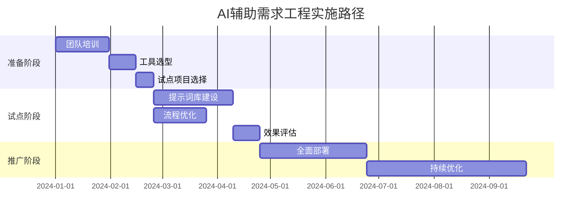
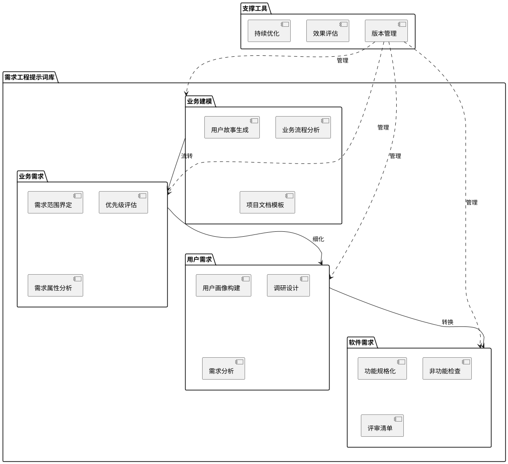
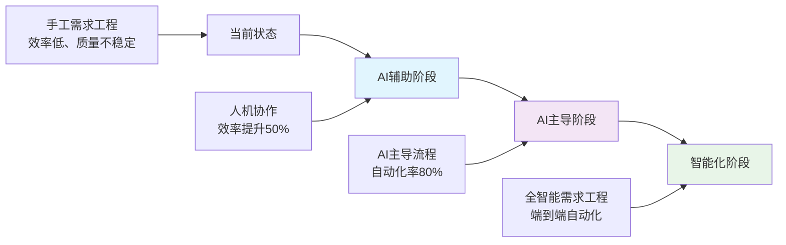

# 大模型赋能B端软件需求工程

## AI Copilot在企业级系统开发中的应用实践

**演讲者：AI-SDLC项目组**
**时间：2025年7月**

---

## 目录

1. **背景与挑战** - B端系统需求工程的痛点
2. **人机协作模式** - 大模型与人的优势互补
3. **需求工程流程分析** - 全流程AI介入点识别
4. **分阶段AI应用** - 具体应用场景和提示词
5. **实施路径与效果** - 落地建议和ROI分析
6. **未来展望** - 智能化需求工程的发展趋势

---

## 第一章：背景与挑战

### B端系统需求工程的现状痛点

<div class="columns">

**传统挑战**

- 📊 业务复杂度高，理解成本大
- 🔄 需求变更频繁，文档维护困难
- 👥 跨部门沟通成本高
- ⏱️ 需求分析周期长
- 📝 文档标准化程度低
- 🎯 需求遗漏和冲突常见

**AI时代的机遇**

- 🤖 自动化文档生成和维护
- 🔍 智能需求分析和冲突检测
- 💬 自然语言处理提升沟通效率
- 📋 标准化流程和模板
- 🎯 精准的需求追踪和管理
- 📊 数据驱动的决策支持

</div>

---

## 第二章：人机协作模式

### 人与大模型的优缺点对比

| 维度               | 人类                  | 大模型              |
| ------------------ | --------------------- | ------------------- |
| **业务理解** | ✅ 深度理解上下文     | ❌ 缺乏真实业务感知 |
| **创新能力** | ✅ 创造性思维         | ❌ 基于已有知识组合 |
| **处理速度** | ❌ 有限的信息处理能力 | ✅ 快速大量数据处理 |
| **一致性**   | ❌ 主观偏见影响       | ✅ 标准化输出       |
| **可用性**   | ❌ 时间和精力限制     | ✅ 24/7持续服务     |
| **学习适应** | ✅ 灵活应变           | ❌ 模型更新周期长   |

---

### 理想的人机协作分工

<div class="highlight">

**人类负责：**

- 🎯 战略决策和业务判断
- 🤝 复杂的利益相关者沟通
- 💡 创新性解决方案设计
- 🔍 实地调研和深度访谈
- ⚖️ 最终的需求优先级决策

</div>

<div class="success">

**大模型负责：**

- 📝 文档标准化和格式化
- 🔄 重复性分析任务
- 📊 数据整理和初步分析
- 🎯 需求一致性检查
- 📋 模板生成和最佳实践应用

</div>

---

## 第三章：需求工程流程分析

### 基于截图的需求开发流程


#### AI重点介入环节分析

**🤖 核心AI介入点：**
- **故事清单生成** - 业务需求自动转换为标准用户故事
- **需求调研分析** - 调研数据智能分析和模式识别  
- **功能需求规格化** - 自动生成标准化需求文档
- **非功能需求检查** - 完整性和一致性自动验证
- **需求评审支持** - 智能生成评审清单和问题识别

**👥 人机协作环节：**
- **业务调研** - AI辅助问卷设计，人工执行访谈
- **用户画像构建** - AI数据分析，人工业务判断
- **需求优先级决策** - AI提供建议，人工最终决策

---

## 第四章：分阶段AI应用

### 4.1 业务建模阶段

#### AI辅助场景

- **业务流程梳理**：自动生成流程图和文档
- **用户故事生成**：标准化故事格式和分解
- **项目文档创建**：模板化文档生成

#### 核心提示词 - 业务流程分析

```markdown
## 角色
你是一位资深的业务分析师，专门负责B端企业系统的业务流程梳理。

## 任务
基于用户提供的业务描述，生成标准化的业务流程文档。

## 输入格式
- 业务领域：[如ERP、OA、CRM等]
- 业务描述：[用户提供的业务场景描述]
- 关键角色：[涉及的用户角色]

## 输出要求
1. 业务流程概述（100字内）
2. 详细流程步骤（编号+描述+责任人）
3. 关键决策点识别
4. 异常流程处理
5. 输入输出清单
6. PlantUML活动图代码

## 示例输出格式
### 业务流程：采购申请流程
**概述**：员工发起采购申请，经部门经理审批后由采购部执行...
```

---

#### 核心提示词 - 用户故事生成

```markdown
## 角色
你是一位敏捷开发专家，擅长将业务需求转换为标准的用户故事。

## 任务
将业务需求转换为符合INVEST原则的用户故事。

## 输入
- 功能描述：[具体功能需求]
- 用户角色：[目标用户群体]
- 业务价值：[解决的业务问题]

## 输出格式
### 用户故事
**作为** [用户角色]
**我希望** [功能需求]
**以便** [业务价值]

**验收标准：**
- [ ] 给定[前置条件]，当[操作行为]，那么[预期结果]
- [ ] [其他验收条件]

**故事点估算：** [1-21]
**优先级：** [高/中/低]
**依赖关系：** [相关故事]

### 任务分解
1. [具体开发任务1]
2. [具体开发任务2]
```

---

### 4.2 业务需求阶段

#### AI辅助场景

- **需求范围界定**：自动识别边界和依赖
- **需求属性分析**：标准化属性模板
- **优先级评估**：多维度评估模型

#### 核心提示词 - 需求范围界定

```markdown
## 角色
你是一位需求工程专家，专长于B端系统的需求范围分析。

## 任务
分析项目需求范围，明确包含和排除的功能边界。

## 输入
- 项目背景：[项目基本信息]
- 初始需求：[收集到的需求列表]
- 资源约束：[时间、人力、预算限制]

## 输出
### 需求范围矩阵
| 功能模块 | 包含程度 | 优先级 | 依赖关系 | 风险评估 |
|----------|----------|--------|----------|----------|
| [模块名] | 核心/重要/可选/排除 | P1/P2/P3 | [依赖项] | [风险点] |

### 边界说明
**明确包含：**
- [功能点1]：[包含原因]

**明确排除：**
- [功能点1]：[排除原因]

**后续版本：**
- [功能点1]：[规划说明]
```

---

### 4.3 用户需求阶段

#### AI辅助场景

- **用户画像构建**：多维度用户分析
- **调研设计**：问卷和访谈大纲
- **需求分析**：调研结果的结构化分析

#### 核心提示词 - 用户画像生成

```markdown
## 角色
你是用户体验研究专家，专门研究B端系统的用户行为和需求。

## 任务
基于用户信息创建详细的用户画像。

## 输入
- 系统类型：[ERP/OA/CRM等]
- 用户基础信息：[角色、部门、工作内容]
- 使用场景：[主要使用场景描述]

## 输出格式
### 用户画像：[角色名称]

**基本信息**
- 姓名：[虚拟姓名]
- 角色：[工作职位]
- 工作年限：[X年]
- 技术水平：[初级/中级/高级]

**工作特征**
- 日常任务：[主要工作内容]
- 工作压力：[时间压力/准确性要求]
- 协作模式：[团队协作方式]

**系统使用行为**
- 使用频率：[每日/每周使用时长]
- 关键功能：[最常用的3-5个功能]
- 痛点问题：[当前遇到的主要问题]

**需求优先级**
1. 核心需求：[必须满足的需求]
2. 期望需求：[希望改善的方面]
3. 兴奋需求：[超出预期的功能]
```

---

### 4.4 软件需求阶段

#### AI辅助场景

- **功能需求规格化**：标准化需求文档
- **非功能需求检查**：完整性验证
- **需求评审**：自动化检查清单

#### 核心提示词 - 功能需求规格化

```markdown
## 角色
你是软件需求工程师，专门编写高质量的软件需求规格说明书。

## 任务
将用户需求转换为标准的软件功能需求规格。

## 输入
- 功能名称：[功能的名称]
- 业务背景：[业务场景描述]
- 用户需求：[用户的原始需求]

## 输出格式
### 功能需求：[功能名称]

**需求编号：** REQ-[模块]-[序号]
**需求描述：** [简洁的功能描述，50字内]

**详细规格：**
1. **输入要求**
   - 数据项1：[类型/格式/约束]
   - 数据项2：[类型/格式/约束]

2. **处理逻辑**
   - 步骤1：[处理步骤描述]
   - 步骤2：[处理步骤描述]
   - 异常处理：[异常情况和处理方式]

3. **输出要求**
   - 成功输出：[预期结果]
   - 错误输出：[错误信息格式]

**性能要求：**
- 响应时间：≤[X]秒
- 并发用户：≥[X]个
- 可用性：≥[X]%

**验证标准：**
- [ ] 功能测试用例1
- [ ] 功能测试用例2
- [ ] 性能测试用例

**追溯关系：**
- 源用户需求：[需求编号]
- 相关需求：[关联需求列表]
```

---

#### 核心提示词 - 非功能需求检查

```markdown
## 角色
你是系统架构师，专门负责非功能需求的完整性检查。

## 任务
检查软件系统的非功能需求覆盖情况，确保没有遗漏。

## 输入
- 系统类型：[Web应用/桌面应用/移动应用]
- 业务场景：[主要业务场景]
- 现有需求：[已识别的非功能需求]

## 检查清单

### 性能需求 ✓
- [ ] 响应时间要求
- [ ] 吞吐量要求
- [ ] 并发用户数
- [ ] 资源利用率

### 可靠性需求 ✓
- [ ] 系统可用性(如99.9%)
- [ ] 故障恢复时间
- [ ] 数据一致性要求
- [ ] 容错机制

### 安全性需求 ✓
- [ ] 身份认证机制
- [ ] 授权访问控制
- [ ] 数据加密要求
- [ ] 审计日志记录

### 可维护性需求 ✓
- [ ] 代码可读性标准
- [ ] 文档维护要求
- [ ] 版本管理规范
- [ ] 监控和告警

### 可移植性需求 ✓
- [ ] 操作系统兼容性
- [ ] 浏览器兼容性
- [ ] 数据库移植性
- [ ] 第三方集成

### 易用性需求 ✓
- [ ] 用户界面规范
- [ ] 操作流程简化
- [ ] 帮助文档要求
- [ ] 培训需求

## 输出格式
### 遗漏需求识别
**高优先级遗漏：**
- [需求类别]：[具体要求]

**建议补充：**
- [需求类别]：[建议内容]
```

---

## 第五章：实施路径与效果

### 5.1 实施路径



---

### 5.2 预期效果

<div class="columns">

**效率提升**

- 📈 需求文档编写效率提升 **50%**
- ⚡ 需求分析周期缩短 **30%**
- 🎯 需求一致性检查准确率 **95%**
- 📝 文档标准化程度提升 **80%**

**质量改善**

- 🔍 需求遗漏率降低 **40%**
- 🔄 需求变更率降低 **25%**
- ✅ 需求评审通过率提升 **35%**
- 📊 需求追踪覆盖率达到 **98%**

</div>

### ROI分析

| 投入项目         | 成本(万元/年) | 收益项目         | 收益(万元/年) |
| ---------------- | ------------- | ---------------- | ------------- |
| AI工具采购       | 10            | 效率提升节省人力 | 45            |
| 培训成本         | 5             | 质量提升减少返工 | 20            |
| 流程优化         | 8             | 项目交付周期缩短 | 30            |
| **总投入** | **23**  | **总收益** | **95**  |

**ROI = (95-23)/23 × 100% = 313%**

---

## 第六章：最佳实践与注意事项

### 6.1 实施建议

<div class="highlight">

**成功关键因素：**

1. **领导支持** - 高层推动和资源保障
2. **人员培训** - 系统性的AI工具培训
3. **流程标准化** - 建立清晰的工作流程
4. **持续优化** - 基于反馈不断改进

</div>

### 6.2 风险与挑战

| 风险类型 | 具体风险     | 应对措施          |
| -------- | ------------ | ----------------- |
| 技术风险 | AI理解偏差   | 人工校验机制      |
| 管理风险 | 流程变更阻力 | 分步推进+培训     |
| 安全风险 | 数据泄露     | 本地部署+权限控制 |
| 质量风险 | 过度依赖AI   | 保持人工判断      |

---

### 6.3 提示词库管理

#### 提示词分类架构



---

## 第七章：未来展望

### 7.1 技术发展趋势

<div class="columns">

**短期发展(1-2年)**

- 🎯 领域专用模型优化
- 🔌 企业系统深度集成
- 📊 个性化提示词推荐
- 🤖 多模态需求输入

**中长期愿景(3-5年)**

- 🧠 全自动需求生成
- 🔄 实时需求验证
- 📈 预测性需求分析
- 🌐 跨系统需求协同

</div>

### 7.2 价值展望



---

## 总结

### 核心观点

1. **人机协作是关键** - 发挥各自优势，实现互补
2. **分阶段逐步推进** - 从简单场景开始，逐步扩展
3. **标准化是基础** - 建立统一的流程和模板
4. **持续优化是保障** - 基于实践反馈不断改进

### 行动建议

<div class="success">

**立即行动：**

- 📋 选择试点项目
- 🎓 开展团队培训
- 🛠️ 搭建基础工具链
- 📊 建立效果评估机制

**持续改进：**

- 🔄 定期更新提示词库
- 📈 监控应用效果
- 💡 收集用户反馈
- 🚀 探索新技术应用

</div>

---

## Q&A

### 常见问题解答

**Q: AI是否会替代需求分析师？**
A: 不会。AI是增强工具，帮助分析师提高效率和质量，人的判断和创造力仍然不可替代。

**Q: 如何保证AI生成内容的准确性？**
A: 建立人工校验机制，关键决策始终由人来做最终确认。

**Q: 实施成本如何控制？**
A: 分阶段推进，从试点开始，逐步扩展，确保投资回报。

**Q: 如何处理企业敏感信息？**
A: 采用本地部署方案，建立严格的数据安全管理制度。

---

## 谢谢！

### 联系我们

**项目组：** AI-SDLC团队
**邮箱：** ai-sdlc@company.com
**GitHub：** https://github.com/company/ai-sdlc

**扫码关注项目进展**

```
[二维码占位符]
```

**让我们一起推动软件需求工程的智能化升级！**
