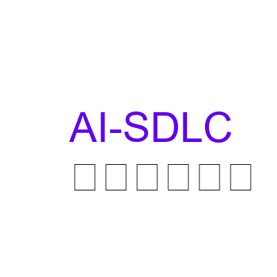
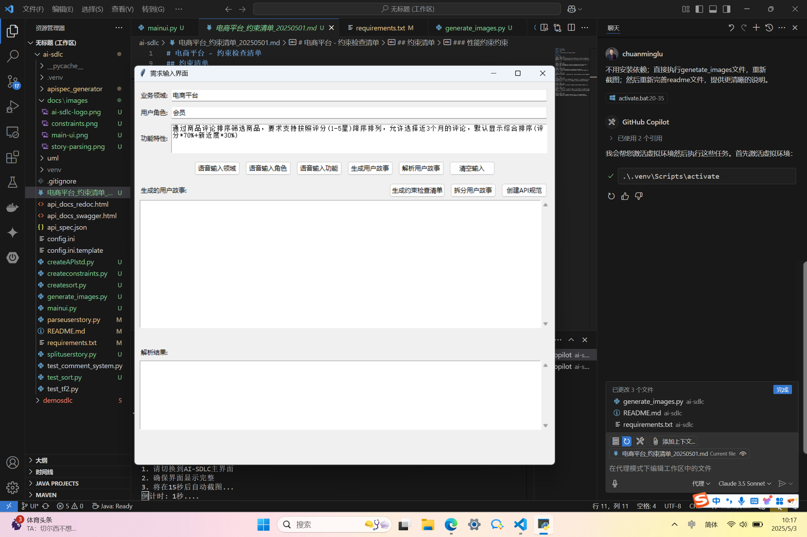
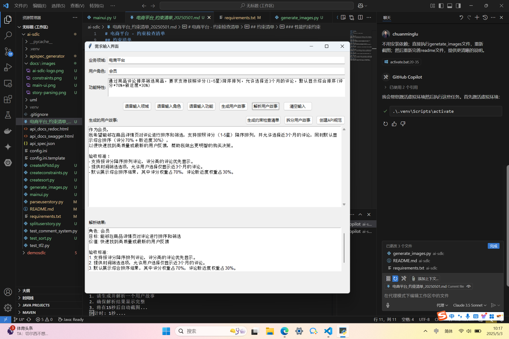
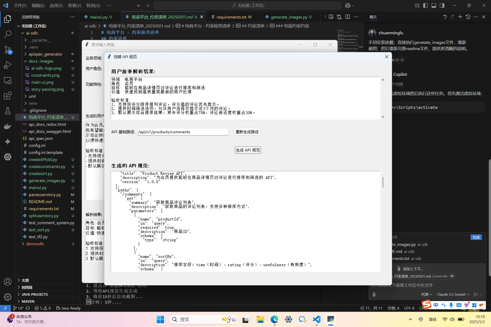
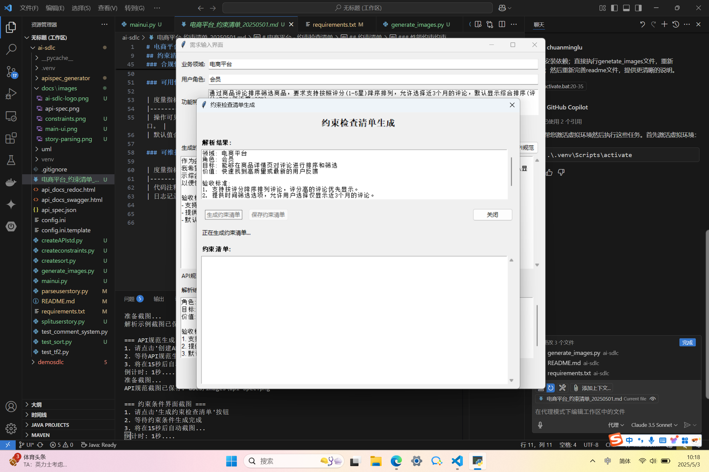

# AI-SDLC 软件开发生命周期智能助手

<div align="center">
    
    <br>
    <p><strong>人工智能辅助软件开发生命周期全流程工具</strong></p>
</div>

## 📖 项目概述

AI-SDLC 是一款集成了人工智能能力的软件开发生命周期工具，专注于用户故事解析、需求冲突分析、API 规范自动生成以及约束条件管理。该工具通过深度学习和自然语言处理技术，自动分析用户需求，发现潜在冲突，并快速转化为规范的 API 文档，大幅提高软件开发效率。

这是一个完全用 AI 驱动的项目，旨在探索如何用人工智能打通软件开发生命周期中的各个环节，从需求分析、冲突检测到 API 设计，再到约束条件管理，构建更可靠的软件产品。

### 📢 自动化工作流

项目集成了 GitHub Actions 自动化工作流，提供以下功能：

1. **需求变更通知**
   - 自动监控需求相关 Issues 的变更
   - 发送邮件通知到指定邮箱
   - 自动添加到项目看板进行跟踪
   - 记录需求变更历史

2. **项目看板管理**
   - 自动创建和维护需求管理项目看板
   - 需求状态自动流转：待分类 → 需求评审 → 已接受/已拒绝 → 进行中 → 已完成
   - 支持测试需求快速创建

### ⚙️ 工作流配置指南

1. **GitHub Secrets 配置**
   ```
   EMAIL_USERNAME: QQ邮箱地址
   EMAIL_PASSWORD: QQ邮箱授权码（不是QQ密码）
   GH_PAT: GitHub Personal Access Token（需要 repo 和 project 权限）
   ```

2. **项目看板设置**
   - 在仓库中创建名为"需求管理"的项目（Projects V2）
   - 确保配置了正确的工作流权限

3. **Issue 标签管理**
   - 使用 "requirement" 标签标识需求类型 Issue
   - 使用 "feature" 标签标识功能类型 Issue

**最新更新：** 新增基于 SpaCy 的需求冲突检测模块，通过 NLP 技术智能识别需求间的潜在冲突（2025年5月）

## ⭐️ 主要功能

1. **💡 智能用户故事生成与解析**
   - 基于业务领域和角色自动生成用户故事
   - 精确提取角色、目标和验收标准
   - 支持中文语音输入，提高效率

2. **🔄 需求冲突检测（新功能）**
   - 基于 SpaCy 的自然语言处理技术
   - 多维度分析：实体识别、名词短语分析、术语一致性检查等
   - 直观的图形界面展示冲突点
   - 自动生成详细冲突报告
   - 支持中文需求文档分析

3. **📊 API规范自动生成**
   - 符合OpenAPI 3.0标准
   - 支持Swagger和Redoc文档界面
   - 自动生成接口定义和示例

4. **🔍 约束条件智能提取**
   - 自动识别性能、安全等约束
   - 生成结构化约束清单
   - 支持导出和共享

5. **📋 PRD文档质量评审**
   - 基于19条专业评审标准进行评估
   - 自动识别文档缺失项
   - 提供具体改进建议

## 🔧 系统架构

项目采用模块化设计，主要包含以下核心组件：

1. **自动化工作流 (.github/workflows/)**
   - 需求变更通知 (requirement-notification.yml)
   - 测试需求创建 (test-requirement.yml)
   - 自动项目看板管理

2. **主界面模块 (mainui.py)**
   - 提供统一的用户界面入口
   - 整合各功能模块

2. **用户故事处理模块**
   - 用户故事解析 (parseuserstory.py)
   - 用户故事分割 (splituserstory.py)

3. **需求冲突检测模块 (conflict_detector/)**
   - 冲突检测核心 (requirements_conflict_detector.py)
   - 冲突检测图形界面 (nlp_conflict_detector_gui.py)
   - 示例需求文件 (enhanced_requirements.py)
   - 测试和示例脚本 (test_conflict_detector.py, example_usage.py)

4. **API规范生成模块**
   - API标准创建 (createAPIstd.py)
   - 排序功能实现 (createsort.py)
   - API规范生成器包 (apispec_generator/)

5. **约束条件管理模块**
   - 约束条件生成 (createconstraints.py)

6. **PRD文档评审模块**
   - 评审界面 (prd_check_ui.py)
   - 评审逻辑 (prd_checker.py)
   - 示例PRD生成 (sample_prd.py)

7. **LLM接口模块**
   - 统一大模型接口 (llm_interface.py)

## 💡 需求冲突检测模块

需求冲突检测是本项目的重要新增功能，它通过先进的自然语言处理技术，从多个维度分析需求文档，识别潜在冲突。

### 核心特性

- **智能冲突检测**：自动识别术语不一致、规则矛盾、时间约束冲突等问题
- **多维度分析**：结合实体识别、名词短语分析、语义角色标注等NLP技术全面分析需求
- **可视化界面**：直观展示冲突关系，支持交互式探索
- **详细报告**：生成结构化冲突报告，提供冲突解释和建议

### 使用示例

```python
from conflict_detector.requirements_conflict_detector import RequirementConflictDetector
from conflict_detector.enhanced_requirements import ECOMMERCE_REQUIREMENTS

# 初始化检测器
detector = RequirementConflictDetector()

# 加载需求
detector.load_requirements(ECOMMERCE_REQUIREMENTS)

# 检测冲突
conflicts = detector.detect_conflicts()

# 生成报告
report = detector.generate_report(conflicts)
print(report)
```

### 集成指南

详细的集成和使用指南请参见 `conflict_detector/integration_guide.md`。

## 📚 参考资料

- [需求冲突分析维度](docs/需求冲突分析维度.md)
- [需求评审标准](docs/需求评审标准.md)

## 🚀 快速开始

### 软件安装

```bash
# 克隆仓库
git clone https://github.com/windlu/ai-sdlc.git
cd ai-sdlc

# 安装依赖
pip install -r requirements.txt

# 安装SpaCy中文语言模型（用于需求冲突检测）
python -m spacy download zh_core_web_sm

# 配置API密钥
cp config.ini.template config.ini
# 编辑config.ini，填入您的API密钥
```

### 使用流程

#### 1. 启动程序
```bash
python mainui.py
```

<div align="center">
    
    <p><em>AI-SDLC 主界面</em></p>
</div>

#### 2. 用户故事生成与解析

<div align="center">
    
    <p><em>用户故事解析界面</em></p>
</div>

- **输入方式**：
  - 文本输入：直接在界面输入
  - 语音输入：支持中文语音识别

#### 3. 需求冲突检测（新功能）

```bash
# 运行冲突检测的图形界面
python conflict_detector/nlp_conflict_detector_gui.py
```

- **功能特点**：
  - 分析需求文档中的潜在冲突
  - 多维度分析：实体识别、术语一致性检查等
  - 冲突树形可视化展示
  - 详细的冲突报告生成
  - 可导出为多种格式（HTML、Markdown、TXT）

- **支持的冲突类型**：
  - 术语不一致
  - 规则匹配冲突
  - 时间约束潜在冲突
  - 安全隐私潜在冲突
  - 功能重叠潜在冲突
  - 默认模板：常见场景快速填充

- **操作步骤**：
  1. 填写业务领域、用户角色和功能特性
  2. 点击"生成用户故事"（约15秒）
  3. 点击"解析用户故事"查看结果

#### 3. API规范生成

<div align="center">
    
    <p><em>API规范生成界面</em></p>
</div>

- **主要功能**：
  - 自动生成RESTful API定义
  - 支持请求/响应示例
  - 生成Swagger文档

- **操作步骤**：
  1. 确保已完成故事解析
  2. 点击"创建API规范"
  3. 等待生成完成（约15秒）
  4. 查看生成的API文档

#### 4. 约束条件管理

<div align="center">
    
    <p><em>约束条件管理界面</em></p>
</div>

- **约束类型**：
  - 性能约束：响应时间、并发数
  - 安全约束：访问控制、数据保护
  - 可靠性约束：服务可用性、数据一致性
  - 其他业务约束

- **操作步骤**：
  1. 点击"生成约束检查清单"
  2. 等待AI分析（约15秒）
  3. 查看生成的约束清单
  4. 可选择保存为Markdown文件

#### 5. PRD文档评审

- **评审标准**：
  - 基于19条专业评审标准
  - 涵盖变更记录、业务背景、需求价值等方面
  - 评分范围：0-100

- **操作步骤**：
  1. 加载PRD文档
  2. 点击"评审文档"
  3. 查看详细评审结果和改进建议

## 💡 提示词模板库

AI-SDLC 内置了多个精心设计的提示词模板，用于不同的功能模块。以下是主要的提示词模板：

### 1. PRD文档评审提示词

```
作为一名专业的需求评审专家，请基于以下评审标准对PRD文档进行分析：

{评审标准列表}

需要评审的PRD文档内容如下：

{PRD文档内容}

请提供一个结构化的JSON评审报告，包含以下内容：
1. missing_items: 文档中缺失的关键要素列表
2. improvement_suggestions: 具体的改进建议列表
3. details: 每个评审标准的详细评分（0-100）和评分理由

注意：
- 评分应该客观公正，有充分理由
- 改进建议应具体且可执行
- 返回的必须是合法的JSON格式
```

### 2. 约束清单生成提示词

```
请你作为软件工程质量专家，为以下用户故事生成系统约束检查清单。
用户故事包含以下信息：
- 领域：{domain}
- 角色：{role}
- 目标：{goal}
- 价值：{value}
- 验收标准：
{criteria_str}

请生成一个全面的约束检查清单，包含以下类型的约束（但不限于这些类型）：
1. 性能约束
2. 安全性约束
3. 可靠性约束
4. 可扩展性约束
5. 兼容性约束
6. 合规性约束
7. 可用性约束
8. 可维护性约束

对于每一项约束，请提供以下信息：
- 约束类型
- 度量指标
- 要求值
- 约束描述

请以JSON格式输出结果。
```

### 3. API规范生成提示词

```
作为一名RESTful API设计专家，请根据以下用户故事为{domain}系统设计API规范：

角色：{role}
目标：{goal}
验收标准：
{criteria}

请设计符合OpenAPI 3.0规范的API定义，包括：
1. 路径和HTTP方法
2. 请求参数和响应模式
3. 示例请求和响应
4. 错误处理
5. 认证方法

返回完整的OpenAPI JSON规范。
```

### 4. 用户故事解析提示词

```
请分析以下用户故事文本，提取关键信息：

{story_text}

请以JSON格式返回以下信息：
1. domain：业务领域
2. role：用户角色
3. goal：用户目标
4. value：业务价值
5. criteria：验收标准（数组形式）

确保提取的信息准确完整，特别是验收标准应该包含所有可衡量的条件。
```

## 🎯 使用场景

1. **需求分析阶段**
   - 快速生成标准用户故事
   - 自动提取关键信息
   - 确保需求完整性

2. **需求冲突检测阶段**
   - 自动识别需求冲突点
   - 防止项目早期缺陷
   - 减少后期返工成本
   - 提高需求质量

3. **API设计阶段**
   - 自动生成API文档
   - 统一接口规范
   - 提高开发效率

4. **质量管理阶段**
   - 识别关键约束
   - 生成检查清单
   - 确保实现质量

4. **文档评审阶段**
   - 自动化需求文档评审
   - 识别文档缺失项
   - 提供专业改进建议

## 📋 开发计划

- [x] 中文语音输入支持
- [x] API文档自动生成
- [x] 约束条件提取
- [x] PRD文档评审
- [ ] 批量故事处理
- [ ] 测试用例生成
- [ ] 多语言支持
- [ ] 离线模型支持

## 👨‍💻 贡献指南

欢迎对 AI-SDLC 项目做出贡献！

1. Fork 仓库并克隆到本地
2. 创建新的功能分支：`git checkout -b feature/amazing-feature`
3. 提交更改：`git commit -m 'Add some amazing feature'`
4. 推送到分支：`git push origin feature/amazing-feature`
5. 提交 Pull Request

## 📄 许可证

本项目采用 MIT 许可证。详情请参阅 LICENSE 文件。

## 📞 联系方式

如有问题或建议，请联系项目维护者或提交 Issue。

---

<div align="center">
    <p>AI-SDLC — 让软件开发更高效、更智能</p>
</div>
