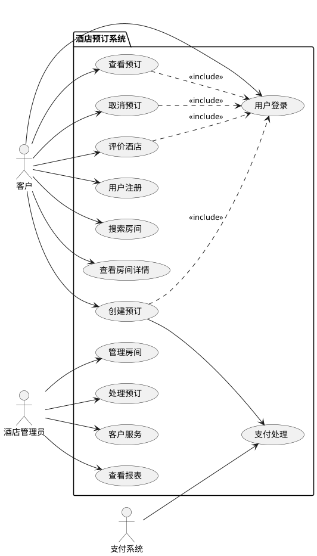

# 小酒店预订Web应用产品需求文档 (PRD)
# Product Requirements Document for Hotel Reservation Web Application

**文档版本**: 1.0  
**创建日期**: 2025年7月16日  
**产品经理**: AI Assistant  
**项目代号**: HotelBooking-v1.0  

---

## 1. 项目目的与范围 (Project Purpose and Scope)

### 1.1 项目背景 (Project Background)
随着数字化转型的推进，传统小酒店面临着在线预订能力缺失、客户体验落后、运营效率低下等挑战。本项目旨在为小酒店构建一个现代化的在线预订系统，提升客户预订体验，优化酒店运营管理。

### 1.2 产品愿景 (Product Vision)
"让每一家小酒店都能拥有媲美连锁酒店的数字化预订体验"

### 1.3 项目目标 (Project Objectives)
- **业务目标**: 提升酒店在线预订转化率30%，减少电话预订工作量50%
- **用户目标**: 提供7×24小时便捷预订服务，3分钟内完成预订流程
- **技术目标**: 构建稳定、安全、可扩展的Web应用系统
- **运营目标**: 降低人工成本20%，提升房间利用率15%

### 1.4 项目范围 (Project Scope)

**包含范围**:
- 客户在线预订系统
- 房间管理系统
- 预订管理系统
- 支付集成系统
- 基础报表系统
- 移动端适配

**不包含范围**:
- 多酒店连锁管理
- 复杂的CRM系统
- 第三方OTA平台集成
- 高级营销自动化
- 会员积分系统

### 1.5 成功标准 (Success Criteria)
- 系统上线后1个月内，在线预订占比达到60%
- 用户预订完成率 > 85%
- 系统响应时间 < 3秒
- 支付成功率 > 98%
- 用户满意度 > 4.5分(5分制)

---

## 2. 市场分析与竞品研究 (Market Analysis & Competitive Research)

### 2.1 目标市场分析 (Target Market Analysis)

**市场规模**:
- 中国中小型酒店数量约15万家，占酒店总数的80%
- 在线预订市场年增长率约12%
- 小酒店数字化渗透率仅35%，增长空间巨大

**市场趋势**:
- 消费者线上预订习惯已养成
- 移动端预订占比超过70%
- 直销预订比例逐年提升
- 个性化服务需求增加

### 2.2 竞品分析 (Competitive Analysis)

| 竞品 | 优势 | 劣势 | 市场定位 |
|------|------|------|----------|
| 携程商家版 | 流量大，品牌知名度高 | 佣金高，客户归属平台 | 大型OTA平台 |
| 美团酒店 | 本地化服务强 | 依赖平台，竞争激烈 | 本地生活服务 |
| 直连系统供应商 | 专业化程度高 | 成本高，定制化不足 | 专业服务商 |
| 自建系统 | 完全自主控制 | 技术门槛高，维护成本高 | 技术实力强的酒店 |

**我们的差异化优势**:
- 专为小酒店设计，简单易用
- 成本可控，无平台佣金
- 快速部署，一周上线
- 本地化服务支持

### 2.3 SWOT分析

**优势(Strengths)**:
- 针对性强，专为小酒店设计
- 成本优势明显
- 技术架构现代化
- 用户体验简洁流畅

**劣势(Weaknesses)**:
- 品牌知名度低
- 流量获取需要投入
- 缺乏行业案例积累

**机会(Opportunities)**:
- 小酒店数字化转型需求强烈
- 政策支持中小企业数字化
- 疫情后卫生安全要求提升

**威胁(Threats)**:
- 大型OTA平台降低佣金竞争
- 客户价格敏感度高
- 技术迭代速度要求快

---

## 3. 用户研究与画像 (User Research & Personas)

### 3.1 用户调研方法 (Research Methods)
- **深度访谈**: 15家小酒店管理者
- **用户调查**: 300名潜在客户在线问卷
- **竞品体验**: 主要竞品完整预订流程体验
- **数据分析**: 行业公开数据分析

### 3.2 核心用户画像 (Primary Personas)

#### 3.2.1 主要用户：酒店客户

**画像1：商务出行者 - 张先生**
- **基本信息**: 32岁，销售经理，月收入12000元
- **行为特征**: 频繁出差，重视效率和便利性
- **使用场景**: 临时出差，需要快速预订经济型酒店
- **核心诉求**: 快速预订、位置便利、价格透明、可随时取消
- **使用设备**: 主要使用手机，偶尔用电脑
- **技能水平**: 熟练使用各类App，接受新技术快

**画像2：休闲旅游者 - 李女士**
- **基本信息**: 28岁，设计师，月收入8000元
- **行为特征**: 注重性价比，喜欢提前规划
- **使用场景**: 周末短途旅游，情侣出行
- **核心诉求**: 环境舒适、拍照好看、性价比高、服务贴心
- **使用设备**: 主要使用手机
- **技能水平**: 中等技术水平，需要简单直观的界面

**画像3：家庭旅游者 - 王先生**
- **基本信息**: 42岁，工程师，月收入15000元
- **行为特征**: 理性决策，重视安全和实用
- **使用场景**: 带孩子出游，需要家庭房
- **核心诉求**: 安全卫生、空间足够、价格合理、服务周到
- **使用设备**: 主要使用电脑，手机为辅
- **技能水平**: 中高技术水平，但偏好简单操作

#### 3.2.2 次要用户：酒店管理者

**画像4：小酒店老板 - 陈总**
- **基本信息**: 45岁，酒店业10年经验
- **经营规模**: 20-50间客房的精品酒店
- **技术水平**: 基础电脑操作，对新技术谨慎
- **核心诉求**: 提升入住率、降低运营成本、客户管理便利
- **痛点**: 缺乏技术人员、预算有限、学习成本

### 3.3 用户旅程地图 (User Journey Map)

#### 商务客户预订旅程
```
发现需求 → 搜索酒店 → 比较选择 → 预订支付 → 确认等待 → 入住体验 → 评价反馈
    ↓         ↓         ↓         ↓         ↓         ↓         ↓
  临时出差   价格位置   看评价图片  快速支付   收到确认   顺利入住   简单评价
  
痛点：搜索结果不准确、预订流程复杂、支付不安全、确认信息不及时
机会：智能推荐、一键预订、多种支付、实时通知
```

---

## 4. 功能需求 (Functional Requirements)

### 4.1 功能概述 (Function Overview)

基于用例驱动的方法，系统主要功能模块包括：

```
酒店预订系统
├── 客户端功能
│   ├── 用户管理 (User Management)
│   ├── 房间浏览 (Room Browsing) 
│   ├── 预订管理 (Reservation Management)
│   └── 支付服务 (Payment Service)
├── 管理端功能  
│   ├── 房间管理 (Room Management)
│   ├── 预订处理 (Booking Processing)
│   ├── 客户服务 (Customer Service)
│   └── 报表分析 (Analytics & Reporting)
└── 系统功能
    ├── 通知服务 (Notification Service)
    ├── 数据同步 (Data Synchronization)
    └── 系统监控 (System Monitoring)
```

### 4.2 详细功能需求 (Detailed Functional Requirements)

#### 4.2.1 用户管理模块 (User Management Module)

**FR-001: 用户注册**
- **需求ID**: FR-001
- **优先级**: 高
- **描述**: 客户可以通过邮箱、手机号注册账户
- **输入**: 用户名、邮箱、手机号、密码
- **处理**: 验证信息唯一性，发送验证码/邮件
- **输出**: 注册成功，创建用户档案
- **前置条件**: 无
- **后置条件**: 用户可以登录系统
- **业务规则**: 
  - 密码长度8-20位，包含字母、数字
  - 同一邮箱/手机号只能注册一次
  - 注册后24小时内必须验证
- **测试用例**: 
  - 正常注册流程
  - 重复邮箱注册
  - 弱密码注册
  - 验证码超时

**FR-002: 用户登录**
- **需求ID**: FR-002
- **优先级**: 高
- **描述**: 用户通过用户名/邮箱和密码登录
- **输入**: 登录凭据（用户名/邮箱 + 密码）
- **处理**: 验证凭据，创建会话
- **输出**: 登录成功，跳转到主页
- **异常**: 连续5次失败锁定账户30分钟
- **业务规则**:
  - 支持记住登录状态（30天）
  - 异地登录安全提醒
  - 会话2小时无操作自动过期

**FR-003: 用户资料管理**
- **需求ID**: FR-003
- **优先级**: 中
- **描述**: 用户可以查看和修改个人资料
- **功能清单**:
  - 查看个人信息
  - 修改基本资料（姓名、电话、地址）
  - 修改密码
  - 设置偏好（语言、通知方式）
  - 上传头像

#### 4.2.2 房间浏览模块 (Room Browsing Module)

**FR-004: 房间搜索**
- **需求ID**: FR-004
- **优先级**: 高
- **描述**: 客户可以搜索符合条件的可用房间
- **搜索条件**:
  - 入住/退房日期（必填）
  - 客人数量（默认1人）
  - 房间类型（可选）
  - 价格范围（可选）
- **排序方式**:
  - 价格从低到高/从高到低
  - 评分从高到低
  - 推荐度（默认）
- **筛选条件**:
  - 房间设施（WiFi、空调、电视等）
  - 床型偏好
  - 楼层偏好
- **性能要求**: 搜索响应时间 < 2秒

**FR-005: 房间详情展示**
- **需求ID**: FR-005
- **优先级**: 高
- **描述**: 展示房间的详细信息和图片
- **展示内容**:
  - 房间图片轮播（至少3张）
  - 房间基本信息（面积、床型、楼层）
  - 设施列表和说明
  - 实时价格和可用性
  - 客户评价和评分
  - 酒店政策（取消、入住时间等）
- **交互功能**:
  - 图片放大查看
  - 评价筛选和排序
  - 一键预订按钮
  - 收藏功能

**FR-006: 房间比较**
- **需求ID**: FR-006
- **优先级**: 低
- **描述**: 用户可以对比不同房间的特点
- **比较维度**:
  - 价格对比
  - 设施对比
  - 面积对比
  - 评分对比
- **限制**: 最多同时比较3个房间

#### 4.2.3 预订管理模块 (Reservation Management Module)

**FR-007: 创建预订**
- **需求ID**: FR-007
- **优先级**: 高
- **描述**: 客户选择房间后创建预订订单
- **输入信息**:
  - 房间选择
  - 入住/退房日期
  - 客人信息（主客人+同行人）
  - 特殊要求（可选）
  - 联系方式确认
- **验证规则**:
  - 房间可用性实时检查
  - 日期合理性验证
  - 客人数量不超过房间容量
  - 最少住宿1晚，最多30晚
- **价格计算**:
  - 基础房费 × 天数
  - 税费计算
  - 折扣优惠应用
  - 总价展示
- **流程控制**:
  - 房间临时锁定15分钟
  - 支付超时自动取消

**FR-008: 支付处理**
- **需求ID**: FR-008
- **优先级**: 高
- **描述**: 处理预订的在线支付
- **支付方式**:
  - 支付宝
  - 微信支付
  - 银行卡（信用卡/借记卡）
- **支付流程**:
  - 价格确认
  - 支付方式选择
  - 支付信息输入
  - 支付处理
  - 结果确认
- **安全措施**:
  - SSL加密传输
  - 支付信息不存储
  - 异常交易监控
- **异常处理**:
  - 支付失败重试机制
  - 网络超时处理
  - 重复支付检测

**FR-009: 预订确认与通知**
- **需求ID**: FR-009
- **优先级**: 高
- **描述**: 支付成功后确认预订并发送通知
- **确认流程**:
  - 生成预订确认号
  - 更新房间状态
  - 发送确认通知
- **通知方式**:
  - 邮件确认（含电子凭证）
  - 短信通知
  - 站内消息
- **通知内容**:
  - 预订详情
  - 酒店联系方式
  - 入住指南
  - 取消政策

**FR-010: 预订查询与管理**
- **需求ID**: FR-010
- **优先级**: 高
- **描述**: 客户查看和管理自己的预订
- **查询功能**:
  - 预订历史列表
  - 预订详情查看
  - 状态筛选（未来、历史、已取消）
  - 搜索功能（按预订号、日期、酒店名）
- **管理功能**:
  - 预订修改（有限条件下）
  - 预订取消
  - 重新预订
  - 评价酒店

**FR-011: 预订取消**
- **需求ID**: FR-011
- **优先级**: 高
- **描述**: 客户在符合条件下取消预订
- **取消条件**:
  - 距离入住时间24小时以上免费取消
  - 24小时内取消收取一晚房费
  - 已入住不可取消
- **取消流程**:
  - 验证取消资格
  - 显示取消政策和费用
  - 用户确认取消
  - 处理退款
  - 发送取消确认
- **退款处理**:
  - 原路退回
  - 3-7个工作日到账
  - 退款状态跟踪

#### 4.2.4 管理端功能 (Admin Functions)

**FR-012: 房间信息管理**
- **需求ID**: FR-012
- **优先级**: 高
- **描述**: 酒店管理员维护房间基础信息
- **管理功能**:
  - 添加新房间
  - 编辑房间信息
  - 上传房间图片
  - 设置房间价格
  - 管理房间状态
- **房间属性**:
  - 基本信息（房号、类型、面积、床型）
  - 设施配置
  - 价格设置（基价、季节价、促销价）
  - 可用状态（可订、维修、停用）

**FR-013: 预订处理管理**
- **需求ID**: FR-013
- **优先级**: 高
- **描述**: 管理员处理客户预订
- **处理功能**:
  - 预订列表查看
  - 预订详情查看
  - 预订状态更新
  - 办理入住/退房
  - 处理特殊要求
- **状态管理**:
  - 待确认 → 已确认
  - 已确认 → 已入住
  - 已入住 → 已完成
  - 任意状态 → 已取消

**FR-014: 客户服务管理**
- **需求ID**: FR-014
- **优先级**: 中
- **描述**: 处理客户咨询和投诉
- **服务功能**:
  - 客户留言查看
  - 在线客服对话
  - 投诉处理记录
  - 客户评价回复

**FR-015: 数据报表分析**
- **需求ID**: FR-015
- **优先级**: 中
- **描述**: 提供经营数据分析报表
- **报表类型**:
  - 预订统计报表
  - 收入分析报表
  - 房间利用率报表
  - 客户来源分析
- **统计维度**:
  - 时间维度（日/周/月/年）
  - 房间类型维度
  - 客户类型维度
- **导出功能**:
  - Excel格式导出
  - PDF报表生成

### 4.3 用例图 (Use Case Diagram)



---

## 5. 非功能需求 (Non-Functional Requirements)

### 5.1 性能需求 (Performance Requirements)

**PF-001: 响应时间要求**
- **页面加载时间**: 
  - 首页加载 < 2秒
  - 搜索结果页 < 3秒
  - 房间详情页 < 2秒
  - 预订确认页 < 1秒
- **数据库查询响应**: 
  - 简单查询 < 100ms
  - 复杂查询 < 500ms
  - 报表查询 < 2秒
- **API接口响应**:
  - 支付接口 < 30秒
  - 短信接口 < 10秒
  - 邮件接口 < 5秒

**PF-002: 并发性能要求**
- **并发用户数**:
  - 正常情况：100个并发用户
  - 高峰期：500个并发用户
  - 系统极限：1000个并发用户
- **事务处理能力**:
  - 每秒预订创建：10个
  - 每秒支付处理：5个
  - 每分钟搜索请求：1000个

**PF-003: 吞吐量要求**
- **数据传输**:
  - 图片加载带宽：10Mbps
  - 数据传输带宽：5Mbps
  - CDN加速：静态资源
- **存储容量**:
  - 图片存储：100GB
  - 数据库存储：10GB
  - 日志存储：20GB

### 5.2 可用性需求 (Availability Requirements)

**AV-001: 系统可用性**
- **可用性目标**: 99.5%（月度）
- **最大停机时间**: 每月不超过3.6小时
- **计划维护窗口**: 每周日凌晨2:00-4:00
- **故障恢复时间**: 
  - 一般故障 < 30分钟
  - 严重故障 < 2小时

**AV-002: 容错能力**
- **数据备份**:
  - 数据库每日全量备份
  - 关键数据实时备份
  - 备份保留期：30天
- **故障切换**:
  - 数据库主从切换 < 1分钟
  - 应用服务器切换 < 30秒
- **降级策略**:
  - 支付异常时允许线下支付
  - 图片加载失败显示默认图片

### 5.3 安全需求 (Security Requirements)

**SC-001: 身份认证与授权**
- **用户认证**:
  - 密码强度要求：8位以上，包含字母数字特殊字符
  - 会话管理：JWT Token，2小时有效期
  - 多次登录失败锁定：5次失败锁定30分钟
  - 异地登录提醒
- **权限控制**:
  - 基于角色的访问控制（RBAC）
  - API接口权限验证
  - 敏感操作二次验证

**SC-002: 数据安全**
- **数据加密**:
  - 传输加密：HTTPS/TLS 1.2+
  - 存储加密：敏感数据AES-256加密
  - 密码存储：bcrypt哈希加密
- **隐私保护**:
  - 个人信息脱敏显示
  - 用户数据最小化收集
  - 符合GDPR/个保法要求
- **支付安全**:
  - PCI DSS合规
  - 支付信息不在本地存储
  - 支付流程SSL加密

**SC-003: 系统安全**
- **网络安全**:
  - WAF防护（SQL注入、XSS攻击）
  - DDOS攻击防护
  - 访问频率限制
- **应用安全**:
  - 输入验证和参数过滤
  - 文件上传安全检查
  - API接口安全防护
- **监控审计**:
  - 安全事件日志记录
  - 异常行为监控告警
  - 定期安全漏洞扫描

### 5.4 易用性需求 (Usability Requirements)

**UX-001: 用户界面要求**
- **设计原则**:
  - 简洁直观，符合用户习惯
  - 响应式设计，适配多设备
  - 无障碍访问支持
- **交互设计**:
  - 关键操作不超过3次点击
  - 重要按钮明显突出
  - 操作反馈及时明确
  - 错误提示友好具体
- **视觉设计**:
  - 统一的设计语言
  - 品牌色彩运用
  - 图片质量高清
  - 字体大小适中

**UX-002: 学习成本要求**
- **新用户引导**:
  - 首次使用引导流程
  - 关键功能提示
  - 帮助文档完善
- **操作复杂度**:
  - 预订流程不超过5步
  - 每步操作说明清晰
  - 支持操作回退

**UX-003: 用户满意度**
- **体验指标**:
  - 任务完成率 > 90%
  - 用户满意度 > 4.5分
  - 客服咨询率 < 5%
- **改进机制**:
  - 用户反馈收集
  - A/B测试优化
  - 定期可用性测试

### 5.5 兼容性需求 (Compatibility Requirements)

**CP-001: 浏览器兼容性**
- **支持浏览器**:
  - Chrome 80+
  - Firefox 75+
  - Safari 13+
  - Edge 80+
  - 移动端浏览器
- **不支持**:
  - IE浏览器
  - 过低版本浏览器

**CP-002: 设备兼容性**
- **PC端**:
  - 最小分辨率：1024×768
  - 推荐分辨率：1920×1080
- **移动端**:
  - iOS 12+
  - Android 8.0+
  - 最小屏幕：320px宽度
- **平板设备**:
  - iPad适配
  - Android平板适配

**CP-003: 第三方系统集成**
- **支付系统**:
  - 支付宝开放平台
  - 微信支付商户平台
  - 银联支付接口
- **消息通知**:
  - 短信服务商API
  - 邮件服务提供商
- **其他服务**:
  - 地图服务API
  - 云存储服务

### 5.6 可维护性需求 (Maintainability Requirements)

**MT-001: 代码质量要求**
- **代码规范**:
  - 遵循团队编码规范
  - 代码注释覆盖率 > 80%
  - 单元测试覆盖率 > 70%
- **架构设计**:
  - 模块化设计
  - 松耦合架构
  - 可扩展性考虑

**MT-002: 监控与日志**
- **系统监控**:
  - 服务器性能监控
  - 应用性能监控
  - 业务指标监控
- **日志管理**:
  - 分级日志记录
  - 日志集中管理
  - 异常自动告警

**MT-003: 版本管理**
- **发布管理**:
  - 版本控制规范
  - 自动化部署
  - 回滚机制
- **文档维护**:
  - API文档自动生成
  - 用户手册更新
  - 技术文档完善

### 5.7 可扩展性需求 (Scalability Requirements)

**SC-001: 系统扩展能力**
- **水平扩展**:
  - 应用服务器集群部署
  - 数据库读写分离
  - 负载均衡配置
- **垂直扩展**:
  - 服务器配置升级
  - 数据库性能优化
  - 缓存策略应用

**SC-002: 功能扩展预留**
- **业务扩展**:
  - 多酒店管理预留
  - 会员系统接口预留
  - 营销活动模块预留
- **技术扩展**:
  - 微服务架构支持
  - API网关预留
  - 消息队列集成

### 5.8 可靠性需求 (Reliability Requirements)

**RL-001: 错误处理**
- **异常恢复**:
  - 系统异常自动恢复
  - 事务失败回滚
  - 数据一致性保证
- **用户体验**:
  - 错误信息友好提示
  - 操作失败重试机制
  - 网络中断恢复

**RL-002: 数据完整性**
- **数据验证**:
  - 输入数据格式验证
  - 业务规则一致性检查
  - 数据同步完整性保证
- **备份恢复**:
  - 定期数据备份
  - 灾难恢复预案
  - 数据恢复测试

---

## 6. 技术架构 (Technical Architecture)

### 6.1 总体架构 (Overall Architecture)

**架构模式**: 分层架构 + 微服务架构
- **表现层**: Vue.js + Element UI
- **应用层**: Spring Boot + Spring Cloud
- **数据层**: MySQL + Redis + MongoDB
- **基础设施**: Docker + Kubernetes + Nginx

### 6.2 技术栈选择 (Technology Stack)

**前端技术**:
- **框架**: Vue.js 3.x
- **UI库**: Element Plus
- **状态管理**: Vuex 4.x
- **路由**: Vue Router 4.x
- **构建工具**: Vite
- **HTTP客户端**: Axios

**后端技术**:
- **开发语言**: Java 11
- **主框架**: Spring Boot 2.7.x
- **微服务**: Spring Cloud 2021.x
- **安全框架**: Spring Security + JWT
- **数据访问**: Spring Data JPA + MyBatis Plus
- **API文档**: Swagger/OpenAPI 3.0

**数据库技术**:
- **关系数据库**: MySQL 8.0
- **缓存数据库**: Redis 6.x
- **搜索引擎**: Elasticsearch 7.x (可选)
- **消息队列**: RabbitMQ 3.9.x

**运维技术**:
- **容器化**: Docker + Docker Compose
- **编排**: Kubernetes (可选)
- **反向代理**: Nginx
- **监控**: Prometheus + Grafana
- **日志**: ELK Stack

### 6.3 部署架构 (Deployment Architecture)

**环境规划**:
- **开发环境**: 单机Docker部署
- **测试环境**: 云服务器集群
- **生产环境**: 负载均衡 + 主从数据库

**服务器配置**:
- **Web服务器**: 2核4GB×2台
- **数据库服务器**: 4核8GB×1台
- **Redis服务器**: 2核4GB×1台
- **负载均衡器**: 1核2GB×1台

---

## 7. 数据需求 (Data Requirements)

### 7.1 数据模型 (Data Model)

**核心实体关系**:
```
User (用户)
├── id: 用户ID
├── username: 用户名
├── email: 邮箱
├── phone: 手机号
├── password: 密码哈希
├── status: 账户状态
└── created_at: 创建时间

Room (房间)
├── id: 房间ID
├── room_number: 房间号
├── room_type: 房间类型
├── price: 基础价格
├── capacity: 容纳人数
├── amenities: 设施配置(JSON)
├── images: 图片URLs(JSON)
├── status: 房间状态
└── description: 房间描述

Reservation (预订)
├── id: 预订ID
├── user_id: 用户ID(外键)
├── room_id: 房间ID(外键)
├── check_in: 入住日期
├── check_out: 退房日期
├── guests: 客人数量
├── total_amount: 总金额
├── status: 预订状态
├── created_at: 创建时间
├── confirmation_code: 确认码
└── special_requests: 特殊要求

Payment (支付)
├── id: 支付ID
├── reservation_id: 预订ID(外键)
├── amount: 支付金额
├── payment_method: 支付方式
├── transaction_id: 交易号
├── status: 支付状态
└── processed_at: 处理时间
```

### 7.2 数据质量要求 (Data Quality Requirements)

**数据准确性**:
- 价格数据精度：小数点后2位
- 日期数据格式：YYYY-MM-DD
- 状态数据：枚举值验证

**数据完整性**:
- 必填字段约束
- 外键关联完整性
- 业务规则完整性检查

**数据安全性**:
- 敏感数据加密存储
- 数据访问权限控制
- 数据传输加密

### 7.3 数据存储策略 (Data Storage Strategy)

**关系数据存储**:
- 用户信息、预订数据存储在MySQL
- 主从复制配置
- 定期备份策略

**缓存数据存储**:
- 热点数据存储在Redis
- 房间可用性缓存
- 用户会话缓存

**文件存储**:
- 图片存储在云端对象存储
- CDN加速分发
- 图片压缩优化

---

## 8. 接口需求 (Interface Requirements)

### 8.1 用户界面需求 (User Interface Requirements)

**界面设计原则**:
- **一致性**: 统一的视觉语言和交互模式
- **简洁性**: 界面简洁清晰，信息层次分明
- **易用性**: 符合用户使用习惯，操作流程简单
- **响应性**: 适配不同设备屏幕尺寸

**关键界面设计**:

**首页界面**:
- 搜索框（日期、房间类型、人数）
- 酒店介绍和特色展示
- 热门房型推荐
- 客户评价展示
- 联系方式和位置信息

**房间列表页**:
- 筛选条件栏（价格、设施、排序）
- 房间卡片展示（图片、价格、基本信息）
- 分页或无限滚动
- 快速预订入口

**房间详情页**:
- 图片画廊展示
- 详细信息介绍
- 价格日历
- 预订表单
- 评价和评分

**预订流程页**:
- 步骤指示器
- 信息填写表单
- 价格明细展示
- 支付方式选择
- 确认页面

### 8.2 API接口需求 (API Interface Requirements)

**接口设计原则**:
- RESTful设计风格
- 统一的响应格式
- 完善的错误处理
- 详细的接口文档

**核心API接口**:

```yaml
# 用户相关接口
POST /api/v1/users/register     # 用户注册
POST /api/v1/users/login        # 用户登录
GET  /api/v1/users/profile      # 获取用户信息
PUT  /api/v1/users/profile      # 更新用户信息

# 房间相关接口
GET  /api/v1/rooms              # 获取房间列表
GET  /api/v1/rooms/{id}         # 获取房间详情
GET  /api/v1/rooms/availability # 检查房间可用性

# 预订相关接口
POST /api/v1/reservations       # 创建预订
GET  /api/v1/reservations       # 获取用户预订列表
GET  /api/v1/reservations/{id}  # 获取预订详情
PUT  /api/v1/reservations/{id}  # 更新预订信息
DELETE /api/v1/reservations/{id} # 取消预订

# 支付相关接口
POST /api/v1/payments           # 创建支付
GET  /api/v1/payments/{id}      # 查询支付状态
POST /api/v1/payments/{id}/refund # 申请退款
```

**响应格式标准**:
```json
{
  "code": 200,
  "message": "success",
  "data": {},
  "timestamp": "2025-07-16T10:30:00Z"
}
```

### 8.3 第三方集成接口 (Third-party Integration)

**支付接口集成**:
- 支付宝开放平台API
- 微信支付商户API
- 银联支付接口

**消息通知接口**:
- 阿里云短信服务
- 腾讯云邮件服务
- 推送通知服务

**其他服务接口**:
- 高德地图API（位置服务）
- 七牛云存储API（图片存储）
- 实名认证API（可选）

---

## 9. 质量属性 (Quality Attributes)

### 9.1 质量目标 (Quality Goals)

| 质量属性 | 目标值 | 测量方法 | 优先级 |
|----------|--------|----------|--------|
| 性能 | 页面响应时间<3s | 性能测试工具 | 高 |
| 可用性 | 系统可用性99.5% | 监控系统统计 | 高 |
| 安全性 | 无重大安全漏洞 | 安全测试+渗透测试 | 高 |
| 易用性 | 用户满意度>4.5分 | 用户调研问卷 | 中 |
| 可维护性 | 代码覆盖率>70% | 自动化测试工具 | 中 |
| 兼容性 | 主流浏览器支持 | 兼容性测试 | 中 |

### 9.2 质量保证措施 (Quality Assurance)

**开发阶段**:
- 代码审查制度
- 单元测试覆盖
- 接口自动化测试
- 安全代码检查

**测试阶段**:
- 功能测试
- 性能压力测试
- 安全渗透测试
- 兼容性测试
- 用户体验测试

**部署阶段**:
- 灰度发布
- 监控告警
- 自动回滚
- 健康检查

---

## 10. 项目约束 (Project Constraints)

### 10.1 技术约束 (Technical Constraints)

**开发技术限制**:
- 必须使用Java技术栈
- 前端使用Vue.js框架
- 数据库使用MySQL
- 部署在Linux环境

**性能约束**:
- 服务器资源有限
- 并发用户数限制
- 存储空间限制
- 网络带宽限制

**安全约束**:
- 必须符合等保二级要求
- 支付必须PCI DSS合规
- 数据传输必须加密
- 个人信息保护合规

### 10.2 业务约束 (Business Constraints)

**预算约束**:
- 开发预算：50万元
- 服务器成本：5000元/月
- 第三方服务费用：2000元/月

**时间约束**:
- 项目周期：4个月
- MVP版本：2个月
- 完整版本：4个月

**人力约束**:
- 项目团队：8人
- 前端开发：2人
- 后端开发：3人
- 测试：1人
- UI设计：1人
- 项目管理：1人

### 10.3 法律法规约束 (Legal Constraints)

**数据保护法规**:
- 《个人信息保护法》合规
- 《网络安全法》合规
- 《数据安全法》合规

**行业规范**:
- 酒店行业服务规范
- 在线支付行业规范
- 消费者权益保护法

---

## 11. 假设与依赖 (Assumptions and Dependencies)

### 11.1 项目假设 (Assumptions)

**业务假设**:
- 目标酒店具备基本的网络环境
- 酒店工作人员能够学会使用管理系统
- 客户具备基本的在线支付能力
- 市场对在线预订服务有足够需求

**技术假设**:
- 第三方支付服务稳定可用
- 云服务提供商服务稳定
- 网络环境能够支持系统运行
- 移动设备普及率持续提升

**用户假设**:
- 用户具备基本的互联网使用技能
- 用户对在线支付有足够信任
- 用户愿意尝试新的预订方式

### 11.2 项目依赖 (Dependencies)

**外部依赖**:
- 支付宝/微信支付接口服务
- 短信/邮件服务提供商
- 云服务器提供商
- 域名和SSL证书服务

**内部依赖**:
- 酒店基础数据准备
- 房间图片拍摄和处理
- 酒店员工培训计划
- 运营推广策略制定

**技术依赖**:
- 开源框架和组件
- 开发工具和环境
- 测试环境搭建
- 部署环境准备

---

## 12. 风险分析 (Risk Analysis)

### 12.1 技术风险 (Technical Risks)

| 风险项 | 概率 | 影响 | 应对策略 |
|--------|------|------|----------|
| 支付接口不稳定 | 中 | 高 | 多支付渠道备份，异常处理机制 |
| 性能不达标 | 中 | 中 | 性能测试，优化方案预案 |
| 安全漏洞 | 低 | 高 | 安全测试，代码审查，渗透测试 |
| 第三方服务故障 | 中 | 中 | 服务降级方案，备用服务商 |

### 12.2 业务风险 (Business Risks)

| 风险项 | 概率 | 影响 | 应对策略 |
|--------|------|------|----------|
| 用户接受度低 | 中 | 高 | 用户调研，产品优化，培训推广 |
| 竞品冲击 | 高 | 中 | 差异化定位，快速迭代优化 |
| 预算超支 | 中 | 中 | 成本控制，分阶段交付 |
| 交付延期 | 中 | 中 | 项目管理，风险预警机制 |

### 12.3 运营风险 (Operational Risks)

| 风险项 | 概率 | 影响 | 应对策略 |
|--------|------|------|----------|
| 数据丢失 | 低 | 高 | 多重备份，灾难恢复预案 |
| 系统宕机 | 中 | 高 | 高可用架构，监控告警 |
| 人员流失 | 中 | 中 | 知识文档化，团队备份 |
| 合规风险 | 低 | 高 | 法务审查，合规检查 |

---

## 13. 验收标准 (Acceptance Criteria)

### 13.1 功能验收标准 (Functional Acceptance Criteria)

**核心功能验收**:
- [ ] 用户注册登录功能正常
- [ ] 房间搜索和展示功能完整
- [ ] 预订流程端到端可用
- [ ] 支付流程安全稳定
- [ ] 管理后台功能完善
- [ ] 数据报表准确可用

**性能验收标准**:
- [ ] 页面加载时间符合要求
- [ ] 并发用户数达到设计要求
- [ ] 系统响应时间在可接受范围
- [ ] 数据库查询性能优化

**兼容性验收**:
- [ ] 主流浏览器兼容性测试通过
- [ ] 移动端设备适配完成
- [ ] 不同屏幕分辨率适配

### 13.2 非功能验收标准 (Non-Functional Acceptance Criteria)

**安全验收**:
- [ ] 安全渗透测试通过
- [ ] 数据加密传输验证
- [ ] 权限控制功能验证
- [ ] 支付安全合规检查

**可用性验收**:
- [ ] 用户体验测试通过
- [ ] 界面设计评审通过
- [ ] 操作流程优化验证

**可维护性验收**:
- [ ] 代码质量检查通过
- [ ] 文档完整性验证
- [ ] 部署自动化验证

---

## 14. 项目计划 (Project Plan)

### 14.1 项目里程碑 (Milestones)

| 里程碑 | 时间 | 交付物 | 验收标准 |
|--------|------|--------|----------|
| 需求确认 | Week 2 | PRD文档 | 需求评审通过 |
| 技术方案 | Week 4 | 技术架构文档 | 技术评审通过 |
| UI设计 | Week 6 | UI设计稿 | 设计评审通过 |
| 开发完成 | Week 14 | 系统功能 | 功能测试通过 |
| 测试完成 | Week 16 | 测试报告 | 测试用例通过 |
| 上线部署 | Week 16 | 生产系统 | 验收测试通过 |

### 14.2 开发计划 (Development Plan)

**第一阶段 (Week 1-4): 项目启动与设计**
- Week 1: 需求调研和分析
- Week 2: PRD文档编写和评审
- Week 3: 技术架构设计
- Week 4: UI/UX设计

**第二阶段 (Week 5-12): 核心开发**
- Week 5-6: 基础框架搭建
- Week 7-8: 用户管理模块开发
- Week 9-10: 房间管理模块开发
- Week 11-12: 预订管理模块开发

**第三阶段 (Week 13-16): 集成测试与上线**
- Week 13: 支付集成和系统联调
- Week 14: 功能测试和bug修复
- Week 15: 性能测试和优化
- Week 16: 用户验收和上线部署

### 14.3 资源分配 (Resource Allocation)

**人力资源分配**:
- 项目经理: 全程参与，负责项目管理
- 产品经理: 前期需求分析，后期产品验收
- UI设计师: 前期界面设计，开发期间设计支持
- 前端开发(2人): Week 5-15，负责前端开发
- 后端开发(3人): Week 5-15，负责后端开发
- 测试工程师: Week 12-16，负责测试工作

**预算分配**:
- 人力成本: 35万元 (70%)
- 服务器成本: 2万元 (4%)
- 第三方服务: 3万元 (6%)
- 其他费用: 10万元 (20%)

---

## 15. 附录 (Appendices)

### 15.1 术语表 (Glossary)

| 术语 | 定义 |
|------|------|
| OTA | Online Travel Agency，在线旅游代理商 |
| PCI DSS | Payment Card Industry Data Security Standard，支付卡行业数据安全标准 |
| JWT | JSON Web Token，基于JSON的开放标准令牌 |
| RBAC | Role-Based Access Control，基于角色的访问控制 |
| CDN | Content Delivery Network，内容分发网络 |
| MVP | Minimum Viable Product，最小可行产品 |
| KPI | Key Performance Indicator，关键绩效指标 |
| SLA | Service Level Agreement，服务级别协议 |

### 15.2 参考文档 (References)

1. Volere需求规格模板 v18
2. 《软件工程：实践者的研究方法》第8版
3. 《用户体验要素》- Jesse James Garrett
4. 《Clean Architecture》- Robert C. Martin
5. 《Building Microservices》- Sam Newman
6. 中华人民共和国《个人信息保护法》
7. 《网络安全法》实施细则
8. PCI DSS 4.0 标准文档

### 15.3 版本历史 (Version History)

| 版本 | 日期 | 修改内容 | 修改人 |
|------|------|----------|--------|
| 1.0 | 2025-07-16 | 初始版本创建 | 产品经理 |

### 15.4 联系信息 (Contact Information)

**项目团队**:
- 产品经理: [姓名] - [邮箱] - [电话]
- 技术经理: [姓名] - [邮箱] - [电话]
- 项目经理: [姓名] - [邮箱] - [电话]

**利益相关者**:
- 业务负责人: [姓名] - [邮箱] - [电话]
- 技术负责人: [姓名] - [邮箱] - [电话]

---

**文档状态**: 待评审  
**文档密级**: 内部  
**文档所有者**: 产品开发部  

---

*本文档为小酒店预订Web应用项目的产品需求文档，基于Volere模板编写，涵盖了产品规划的各个方面。文档将随着项目进展持续更新和完善。*
