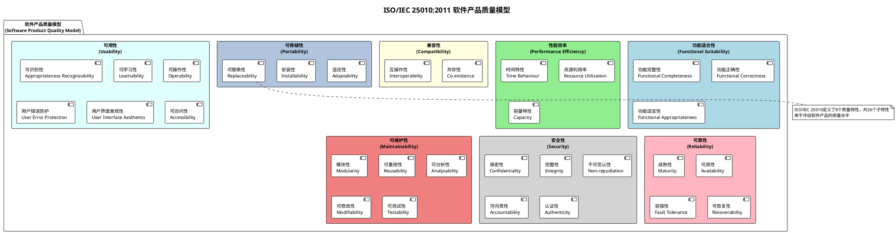
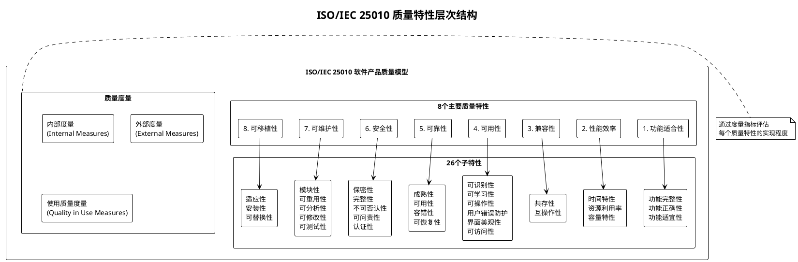

# 酒店预订系统ISO 25010质量需求详细规范

## 版本信息
- **文档版本**: 2.0
- **创建日期**: 2025年7月17日
- **最后更新**: 2025年7月17日
- **适用标准**: ISO/IEC 25010:2011
- **项目名称**: 酒店预订系统

---

## ISO 25010质量模型整体结构图

## ISO 25010质量特性层次结构

---

## 目录

1. [功能适合性 (Functional Suitability)](#1-功能适合性-functional-suitability)
2. [性能效率 (Performance Efficiency)](#2-性能效率-performance-efficiency)
3. [兼容性 (Compatibility)](#3-兼容性-compatibility)
4. [可用性 (Usability)](#4-可用性-usability)
5. [可靠性 (Reliability)](#5-可靠性-reliability)
6. [安全性 (Security)](#6-安全性-security)
7. [可维护性 (Maintainability)](#7-可维护性-maintainability)
8. [可移植性 (Portability)](#8-可移植性-portability)
9. [质量度量标准](#9-质量度量标准)
10. [验收测试方法](#10-验收测试方法)

---

## 1. 功能适合性 (Functional Suitability)

### 1.1 功能完整性 (Functional Completeness)

#### 1.1.1 核心业务功能
- **用户管理**: 注册、登录、个人信息管理、密码找回
- **房间管理**: 房间信息展示、实时库存查询、价格展示
- **预订管理**: 在线预订、预订确认、预订修改、预订取消
- **支付处理**: 多种支付方式、支付确认、退款处理
- **订单管理**: 订单查询、订单历史、订单状态跟踪
- **客服支持**: 在线客服、意见反馈、投诉处理

#### 1.1.2 管理员功能
- **房间管理**: 房间信息维护、价格设置、库存管理
- **预订管理**: 预订审核、预订确认、特殊需求处理
- **客户管理**: 客户信息查看、VIP客户管理
- **财务管理**: 收入统计、退款管理、财务报表
- **系统管理**: 用户权限、系统配置、日志管理

#### 1.1.3 业务规则
- 预订时间规则：最少提前1小时，最多提前180天
- 取消政策：入住前24小时免费取消，之后收取一晚房费
- 房间分配：优先满足特殊需求，自动升级房型
- 价格策略：动态定价、会员折扣、促销活动

**度量标准**:
- 功能覆盖率 ≥ 95%
- 业务规则正确执行率 ≥ 99.9%
- 核心功能可用性 ≥ 99.5%

### 1.2 功能正确性 (Functional Correctness)

#### 1.2.1 数据准确性
- 房间可用性实时更新，延迟 ≤ 30秒
- 价格计算准确，包含税费、折扣、附加服务
- 预订信息完整性，字段验证无误
- 支付金额与订单金额一致性检查

#### 1.2.2 业务逻辑正确性
- 房间超售控制：防止同一房间被重复预订
- 库存管理：实时扣减可用房间数量
- 价格计算：正确应用折扣、税费、附加费用
- 状态流转：预订状态按业务流程正确变更

**度量标准**:
- 数据一致性检查通过率 ≥ 99.99%
- 业务逻辑错误率 ≤ 0.01%
- 核心算法准确率 ≥ 99.95%

### 1.3 功能适宜性 (Functional Appropriateness)

#### 1.3.1 用户体验优化
- 预订流程简化：3步完成预订
- 智能推荐：基于用户历史推荐合适房型
- 快速搜索：房间筛选功能完善
- 多语言支持：中文、英文界面切换

#### 1.3.2 业务场景适配
- 团体预订：支持多房间批量预订
- 企业协议：支持企业客户特殊价格
- 促销活动：支持各种优惠活动配置
- 会员体系：积分累积、等级权益

**度量标准**:
- 用户操作步骤 ≤ 5步完成核心功能
- 业务场景覆盖率 ≥ 90%
- 用户满意度 ≥ 4.5/5.0

---

## 2. 性能效率 (Performance Efficiency)

### 2.1 时间特性 (Time Behaviour)

#### 2.1.1 响应时间要求
- **页面加载时间**:
  - 首页 ≤ 1.5秒
  - 房间列表页 ≤ 2秒
  - 预订页面 ≤ 1秒
  - 支付页面 ≤ 0.8秒
- **API响应时间**:
  - 房间查询 ≤ 500ms
  - 预订创建 ≤ 1秒
  - 支付处理 ≤ 3秒
  - 数据查询 ≤ 200ms

#### 2.1.2 事务处理时间
- 预订确认处理 ≤ 2秒
- 支付处理 ≤ 5秒
- 取消预订 ≤ 1秒
- 报表生成 ≤ 10秒

**度量标准**:
- 95%的请求响应时间符合要求
- 99分位响应时间 ≤ 2倍标准时间
- 超时率 ≤ 0.1%

### 2.2 资源利用率 (Resource Utilization)

#### 2.2.1 服务器资源
- **CPU使用率**: 正常负载 ≤ 60%，峰值 ≤ 80%
- **内存使用率**: 正常负载 ≤ 70%，峰值 ≤ 85%
- **磁盘I/O**: 读写响应时间 ≤ 10ms
- **网络带宽**: 利用率 ≤ 80%

#### 2.2.2 数据库资源
- 连接池使用率 ≤ 80%
- 查询执行时间 ≤ 100ms (95%)
- 索引命中率 ≥ 95%
- 缓存命中率 ≥ 85%

#### 2.2.3 客户端资源
- 移动端内存占用 ≤ 100MB
- 页面包大小 ≤ 2MB
- 图片加载优化，懒加载实现
- 离线缓存支持关键数据

**度量标准**:
- 资源使用效率 ≥ 80%
- 资源泄露率 = 0
- 自动扩容触发阈值：CPU > 70%, 内存 > 75%

### 2.3 容量特性 (Capacity)

#### 2.3.1 并发用户支持
- **在线用户数**: ≥ 5,000
- **并发预订**: ≥ 1,000
- **峰值支持**: ≥ 10,000 (节假日)
- **数据库连接**: ≥ 500

#### 2.3.2 数据存储容量
- 用户数据：≥ 100万用户
- 预订记录：≥ 1000万订单
- 历史数据：≥ 3年保存
- 日志数据：≥ 6个月保存

#### 2.3.3 系统吞吐量
- 预订处理：≥ 500 TPS
- 查询处理：≥ 2000 QPS
- 支付处理：≥ 200 TPS
- 数据同步：≥ 1000 records/second

**度量标准**:
- 容量规划准确率 ≥ 95%
- 扩容响应时间 ≤ 5分钟
- 容量预警提前3天

---

## 3. 兼容性 (Compatibility)

### 3.1 共存性 (Co-existence)

#### 3.1.1 系统共存
- 与酒店PMS系统无缝集成
- 与财务系统数据同步
- 与CRM系统客户信息共享
- 与OTA平台库存同步

#### 3.1.2 第三方服务集成
- 支付网关：支付宝、微信支付、银联
- 地图服务：百度地图、高德地图
- 短信服务：阿里云、腾讯云
- 邮件服务：企业邮箱、第三方邮件

**度量标准**:
- 集成成功率 ≥ 99.5%
- 数据同步延迟 ≤ 1分钟
- 接口调用成功率 ≥ 99.9%

### 3.2 互操作性 (Interoperability)

#### 3.2.1 数据交换标准
- API接口遵循RESTful规范
- 数据格式支持JSON、XML
- 字符编码统一UTF-8
- 时间格式遵循ISO 8601标准

#### 3.2.2 协议支持
- HTTP/HTTPS协议
- WebSocket实时通信
- SOAP协议（遗留系统）
- FTP文件传输协议

#### 3.2.3 平台兼容性
- **浏览器支持**:
  - Chrome 90+
  - Firefox 88+
  - Safari 14+
  - Edge 90+
- **操作系统支持**:
  - Windows 10/11
  - macOS 11+
  - iOS 14+
  - Android 8+

**度量标准**:
- 跨平台功能一致性 ≥ 95%
- 浏览器兼容测试通过率 ≥ 98%
- 数据交换成功率 ≥ 99.8%

---

## 4. 可用性 (Usability)

### 4.1 可识别性 (Appropriateness Recognizability)

#### 4.1.1 界面设计
- 清晰的视觉层次和信息架构
- 一致的UI组件和交互模式
- 符合用户心理模型的导航结构
- 品牌识别元素统一应用

#### 4.1.2 信息呈现
- 关键信息突出显示
- 房间信息完整准确
- 价格信息透明清晰
- 预订流程进度指示

**度量标准**:
- 首次使用成功率 ≥ 85%
- 界面识别度测试得分 ≥ 4.0/5.0

### 4.2 可学习性 (Learnability)

#### 4.2.1 操作引导
- 新用户引导流程
- 关键功能操作提示
- 在线帮助文档
- 视频操作指南

#### 4.2.2 学习成本
- 预订流程≤3步完成
- 操作指令清晰明确
- 错误提示具体有用
- 功能分组逻辑清晰

**度量标准**:
- 新用户学习时间 ≤ 10分钟
- 操作错误率 ≤ 5%
- 帮助文档查阅率 ≤ 15%

### 4.3 可操作性 (Operability)

#### 4.3.1 操作效率
- 常用功能一键访问
- 批量操作支持
- 快捷键支持
- 操作撤销功能

#### 4.3.2 操作便利性
- 表单自动填充
- 智能输入建议
- 记住用户偏好
- 多设备同步

**度量标准**:
- 操作效率提升 ≥ 30%
- 重复操作减少 ≥ 50%
- 用户任务完成率 ≥ 95%

### 4.4 用户错误防护 (User Error Protection)

#### 4.4.1 输入验证
- 实时表单验证
- 数据格式检查
- 必填字段提示
- 数据范围限制

#### 4.4.2 操作确认
- 重要操作二次确认
- 删除操作安全提示
- 支付前信息确认
- 取消操作警告

**度量标准**:
- 用户操作错误率 ≤ 2%
- 错误恢复成功率 ≥ 90%

### 4.5 用户界面美观性 (User Interface Aesthetics)

#### 4.5.1 视觉设计
- 现代化扁平设计风格
- 一致的色彩搭配方案
- 合适的字体大小和间距
- 高质量图片和图标

#### 4.5.2 交互设计
- 流畅的动画效果
- 响应式布局设计
- 触摸友好的交互元素
- 加载状态反馈

**度量标准**:
- UI设计评分 ≥ 4.5/5.0
- 视觉一致性 ≥ 95%

### 4.6 可访问性 (Accessibility)

#### 4.6.1 无障碍支持
- 遵循WCAG 2.1 AA标准
- 键盘导航支持
- 屏幕阅读器兼容
- 色彩对比度符合标准

#### 4.6.2 多样化支持
- 多语言界面支持
- 字体大小调节
- 高对比度模式
- 语音输入支持

**度量标准**:
- 无障碍测试通过率 ≥ 95%
- 色彩对比度 ≥ 4.5:1
- 键盘操作覆盖率 = 100%

---

## 5. 可靠性 (Reliability)

### 5.1 成熟性 (Maturity)

#### 5.1.1 系统稳定性
- 7×24小时连续运行
- 故障自动检测和报告
- 异常情况自动处理
- 系统监控和告警

#### 5.1.2 错误处理
- 全面的异常捕获
- 优雅的错误降级
- 详细的错误日志
- 用户友好的错误提示

**度量标准**:
- 系统可用性 ≥ 99.9%
- 平均故障间隔时间(MTBF) ≥ 720小时
- 未处理异常率 ≤ 0.01%

### 5.2 可用性 (Availability)

#### 5.2.1 服务可用性
- **正常营业时间**: 99.99%可用性
- **维护时间窗口**: 凌晨2-4点，月度维护
- **紧急恢复**: 5分钟内恢复核心服务
- **灾备切换**: 15分钟内完成切换

#### 5.2.2 数据可用性
- 实时数据备份
- 多地域数据冗余
- 快照恢复机制
- 增量备份策略

**度量标准**:
- 年度可用性 ≥ 99.9% (8.76小时停机)
- 计划内停机 ≤ 4小时/月
- 数据恢复时间目标(RTO) ≤ 1小时

### 5.3 容错性 (Fault Tolerance)

#### 5.3.1 系统容错
- 单点故障自动切换
- 服务降级策略
- 熔断器机制
- 限流保护

#### 5.3.2 数据容错
- 主从数据库切换
- 分布式事务保证
- 数据一致性检查
- 自动修复机制

**度量标准**:
- 故障影响范围 ≤ 10%用户
- 自动恢复成功率 ≥ 95%
- 数据丢失率 = 0

### 5.4 可恢复性 (Recoverability)

#### 5.4.1 故障恢复
- **恢复时间目标(RTO)**: ≤ 1小时
- **恢复点目标(RPO)**: ≤ 15分钟
- **自动恢复**: 服务自动重启
- **手动恢复**: 详细恢复流程

#### 5.4.2 数据恢复
- 增量备份：每4小时
- 全量备份：每日凌晨
- 异地备份：实时同步
- 恢复测试：月度验证

**度量标准**:
- 恢复成功率 ≥ 99%
- 数据完整性 = 100%
- 恢复演练通过率 ≥ 95%

---

## 6. 安全性 (Security)

### 6.1 保密性 (Confidentiality)

#### 6.1.1 数据加密
- **传输加密**: TLS 1.3, HTTPS强制
- **存储加密**: AES-256数据库加密
- **密码加密**: bcrypt哈希算法
- **敏感数据**: 字段级加密存储

#### 6.1.2 访问控制
- 基于角色的权限控制(RBAC)
- 最小权限原则
- 会话管理和超时
- 多因子认证(MFA)

**度量标准**:
- 数据泄露事件 = 0
- 加密覆盖率 = 100%
- 未授权访问阻止率 ≥ 99.9%

### 6.2 完整性 (Integrity)

#### 6.2.1 数据完整性
- 数据校验和验证
- 事务完整性保证
- 数据版本控制
- 审计日志记录

#### 6.2.2 系统完整性
- 代码签名验证
- 系统文件监控
- 恶意代码检测
- 完整性定期校验

**度量标准**:
- 数据完整性 = 100%
- 篡改检测率 = 100%
- 完整性验证通过率 ≥ 99.99%

### 6.3 不可否认性 (Non-repudiation)

#### 6.3.1 操作审计
- 完整的操作日志
- 用户行为追踪
- 时间戳和数字签名
- 日志防篡改机制

#### 6.3.2 交易记录
- 预订操作记录
- 支付交易凭证
- 状态变更历史
- 法律证据保全

**度量标准**:
- 审计日志覆盖率 = 100%
- 日志完整性 = 100%
- 证据链完整性 ≥ 99.99%

### 6.4 可问责性 (Accountability)

#### 6.4.1 用户标识
- 唯一用户身份识别
- 操作归属确认
- 会话关联追踪
- 责任链明确

#### 6.4.2 监控告警
- 异常行为检测
- 实时安全监控
- 威胁情报集成
- 安全事件响应

**度量标准**:
- 用户操作可追溯率 = 100%
- 异常检测准确率 ≥ 95%
- 安全事件响应时间 ≤ 1小时

### 6.5 认证性 (Authenticity)

#### 6.5.1 身份认证
- 多种认证方式支持
- 强密码策略
- 登录尝试限制
- 验证码机制

#### 6.5.2 授权验证
- JWT Token认证
- API访问控制
- 资源权限检查
- 跨域访问控制

**度量标准**:
- 身份认证成功率 ≥ 99.5%
- 暴力破解阻止率 = 100%
- 伪造攻击防护率 ≥ 99.9%

---

## 7. 可维护性 (Maintainability)

### 7.1 模块性 (Modularity)

#### 7.1.1 系统架构
- 微服务架构设计
- 模块间低耦合
- 接口标准化
- 服务独立部署

#### 7.1.2 代码组织
- 分层架构清晰
- 组件可重用性
- 功能模块划分
- 依赖关系简单

**度量标准**:
- 模块耦合度 ≤ 0.3
- 代码重用率 ≥ 60%
- 接口稳定性 ≥ 95%

### 7.2 可重用性 (Reusability)

#### 7.2.1 组件设计
- 通用组件库
- 业务组件抽象
- 配置外部化
- 插件机制支持

#### 7.2.2 代码复用
- 公共库提取
- 工具类封装
- 模板化设计
- API标准化

**度量标准**:
- 组件复用率 ≥ 70%
- 代码重复率 ≤ 10%
- 新功能开发效率提升 ≥ 40%

### 7.3 可分析性 (Analysability)

#### 7.3.1 日志系统
- 结构化日志记录
- 分级日志管理
- 日志聚合分析
- 性能指标收集

#### 7.3.2 监控体系
- APM应用监控
- 基础设施监控
- 业务指标监控
- 实时告警机制

**度量标准**:
- 问题定位时间 ≤ 30分钟
- 日志覆盖率 ≥ 90%
- 监控指标完整性 ≥ 95%

### 7.4 可修改性 (Modifiability)

#### 7.4.1 配置管理
- 配置中心化管理
- 环境配置分离
- 热配置更新
- 版本配置控制

#### 7.4.2 扩展机制
- 插件式架构
- 事件驱动设计
- 策略模式应用
- 接口版本管理

**度量标准**:
- 配置变更生效时间 ≤ 5分钟
- 功能修改影响范围 ≤ 20%
- 向后兼容性 ≥ 95%

### 7.5 可测试性 (Testability)

#### 7.5.1 测试设计
- 单元测试覆盖
- 集成测试自动化
- 契约测试验证
- 性能测试集成

#### 7.5.2 测试环境
- 测试数据管理
- 环境一致性
- 自动化测试流水线
- 测试报告生成

**度量标准**:
- 代码覆盖率 ≥ 85%
- 自动化测试比例 ≥ 80%
- 测试执行时间 ≤ 30分钟

---

## 8. 可移植性 (Portability)

### 8.1 适应性 (Adaptability)

#### 8.1.1 环境适配
- 多云平台支持
- 容器化部署
- 操作系统无关
- 硬件架构兼容

#### 8.1.2 配置适应
- 环境参数化
- 资源配置灵活
- 网络拓扑适应
- 存储方案可选

**度量标准**:
- 环境适配成功率 ≥ 95%
- 配置迁移时间 ≤ 2小时
- 跨平台兼容性 ≥ 98%

### 8.2 安装性 (Installability)

#### 8.2.1 部署方案
- 一键部署脚本
- Docker容器部署
- Kubernetes编排
- 蓝绿部署支持

#### 8.2.2 安装验证
- 健康检查机制
- 依赖项检查
- 配置验证
- 功能验证测试

**度量标准**:
- 部署成功率 ≥ 98%
- 部署时间 ≤ 30分钟
- 回滚成功率 = 100%

### 8.3 可替换性 (Replaceability)

#### 8.3.1 组件替换
- 数据库可替换性
- 中间件可替换性
- 第三方服务替换
- 存储方案替换

#### 8.3.2 数据迁移
- 数据导出标准
- 数据格式转换
- 增量数据迁移
- 数据一致性验证

**度量标准**:
- 组件替换成功率 ≥ 95%
- 数据迁移完整性 = 100%
- 替换停机时间 ≤ 4小时

---

## 9. 质量度量标准

### 9.1 度量指标体系

#### 9.1.1 功能性指标
| 指标名称 | 度量方法 | 目标值 | 测试方法 |
|----------|----------|--------|----------|
| 功能覆盖率 | 已实现功能/需求功能 | ≥95% | 需求追溯矩阵 |
| 功能正确率 | 正确功能/总功能 | ≥99.9% | 功能测试 |
| 业务规则符合率 | 符合规则数/总规则数 | 100% | 业务测试 |

#### 9.1.2 性能指标
| 指标名称 | 度量方法 | 目标值 | 测试方法 |
|----------|----------|--------|----------|
| 响应时间 | 请求发出到响应接收 | ≤1秒 | 性能测试 |
| 并发用户数 | 同时在线活跃用户 | ≥1000 | 负载测试 |
| 系统吞吐量 | 单位时间处理请求数 | ≥200TPS | 压力测试 |
| 资源利用率 | 资源使用/资源总量 | ≤70% | 监控统计 |

#### 9.1.3 可靠性指标
| 指标名称 | 度量方法 | 目标值 | 测试方法 |
|----------|----------|--------|----------|
| 系统可用性 | 正常运行时间/总时间 | ≥99.9% | 可用性监控 |
| 故障恢复时间 | 故障发生到恢复正常 | ≤1小时 | 故障演练 |
| 数据完整性 | 完整数据/总数据 | 100% | 数据校验 |

### 9.2 质量监控体系

#### 9.2.1 实时监控
- **性能监控**: APM工具监控应用性能
- **可用性监控**: 服务健康检查和告警
- **安全监控**: 安全事件实时检测
- **业务监控**: 关键业务指标追踪

#### 9.2.2 定期评估
- **周度评估**: 性能指标、错误率统计
- **月度评估**: 可用性报告、安全评估
- **季度评估**: 全面质量评估报告
- **年度评估**: 质量改进计划制定

---

## 10. 验收测试方法

### 10.1 功能验收测试

#### 10.1.1 用户验收测试(UAT)
- **测试对象**: 所有用户功能
- **测试方法**: 真实用户场景测试
- **验收标准**: 100%核心功能正常
- **测试工具**: 手工测试+自动化测试

#### 10.1.2 业务流程测试
- **预订流程**: 端到端预订测试
- **支付流程**: 多种支付方式测试
- **管理流程**: 后台管理功能测试
- **集成流程**: 第三方系统集成测试

### 10.2 性能验收测试

#### 10.2.1 负载测试
- **测试工具**: JMeter, LoadRunner
- **测试场景**: 正常负载、峰值负载
- **测试指标**: 响应时间、吞吐量、错误率
- **验收标准**: 满足性能指标要求

#### 10.2.2 压力测试
- **极限测试**: 系统承载能力测试
- **稳定性测试**: 长时间运行测试
- **恢复测试**: 压力后恢复能力测试

### 10.3 安全验收测试

#### 10.3.1 安全扫描
- **漏洞扫描**: OWASP Top 10检查
- **代码审计**: 静态代码安全分析
- **渗透测试**: 模拟攻击测试
- **合规检查**: 安全合规标准验证

#### 10.3.2 安全功能测试
- **认证测试**: 身份认证功能测试
- **授权测试**: 访问控制测试
- **加密测试**: 数据加密功能测试
- **审计测试**: 日志记录功能测试

### 10.4 兼容性验收测试

#### 10.4.1 浏览器兼容性
- **主流浏览器**: Chrome, Firefox, Safari, Edge
- **移动浏览器**: iOS Safari, Android Chrome
- **版本覆盖**: 最近2个主要版本
- **功能一致性**: 跨浏览器功能对比

#### 10.4.2 设备兼容性
- **桌面设备**: Windows, macOS, Linux
- **移动设备**: iOS, Android设备
- **分辨率适配**: 多种屏幕分辨率测试
- **触控操作**: 触摸屏操作测试

---

## 附录

### A. 质量标准参考
- ISO/IEC 25010:2011 - 系统与软件质量模型
- ISO/IEC 25023:2016 - 系统与软件质量测量
- ISO/IEC 27001:2013 - 信息安全管理体系
- WCAG 2.1 - Web内容无障碍指南

### B. 测试工具推荐
- **性能测试**: JMeter, LoadRunner, Gatling
- **安全测试**: OWASP ZAP, Burp Suite, Nessus
- **自动化测试**: Selenium, Cypress, Playwright
- **监控工具**: Prometheus, Grafana, ELK Stack

### C. 质量改进流程
1. **质量度量**: 定期收集质量指标数据
2. **问题识别**: 分析质量指标，识别问题
3. **原因分析**: 深入分析问题根本原因
4. **改进措施**: 制定针对性改进措施
5. **效果验证**: 验证改进措施有效性
6. **持续改进**: 形成质量改进闭环

---

> **文档说明**: 本文档基于ISO/IEC 25010:2011标准，结合酒店预订系统的具体业务特点和技术要求，制定了详细的质量需求规范。文档涵盖了8个质量特性的所有子特性，为系统设计、开发、测试和运维提供了全面的质量指导。
