# 酒店预订系统软件架构文档 (SAD)
## Software Architecture Document for Hotel Reservation System

**版本**: 1.0  
**日期**: 2025年7月16日  
**作者**: AI Assistant  

---

## 目录

1. [引言](#1-引言)
2. [架构表示](#2-架构表示)
3. [架构目标和约束](#3-架构目标和约束)
4. [用例视图](#4-用例视图)
5. [逻辑视图](#5-逻辑视图)
6. [进程视图](#6-进程视图)
7. [实施视图](#7-实施视图)
8. [部署视图](#8-部署视图)
9. [架构质量](#9-架构质量)
10. [附录](#10-附录)
11. [核心用例详细分析：预订房间](#11-核心用例详细分析预订房间)

---

## 1. 引言

### 1.1 目的
本文档描述了酒店预订系统的软件架构，基于面向对象分析与设计(OOAD)原则，采用UML 4+1视图模型来全面展示系统的架构。

### 1.2 范围
本文档涵盖了一个简单酒店预订网站的完整软件架构，包括：
- 客户在线房间预订
- 房间管理
- 预订管理
- 用户管理
- 支付处理

### 1.3 定义、缩略语和缩写
- **OOAD**: Object-Oriented Analysis and Design (面向对象分析与设计)
- **UML**: Unified Modeling Language (统一建模语言)
- **SAD**: Software Architecture Document (软件架构文档)
- **MVC**: Model-View-Controller (模型-视图-控制器)
- **REST**: Representational State Transfer (表现状态转移)

### 1.4 参考文献
- UML 2.5 规范
- Microsoft Solution Framework
- GoF 设计模式

---

## 2. 架构表示

本系统采用UML 4+1视图模型进行架构表示：

- **用例视图**: 描述系统功能需求
- **逻辑视图**: 描述系统的静态结构和类关系
- **进程视图**: 描述系统的动态行为和交互
- **实施视图**: 描述系统的组件和包结构
- **部署视图**: 描述系统的物理部署

### 2.1 架构风格
采用分层架构 + MVC模式：
- 表示层 (Presentation Layer)
- 业务逻辑层 (Business Logic Layer)
- 数据访问层 (Data Access Layer)
- 数据库层 (Database Layer)

---

## 3. 架构目标和约束

### 3.1 架构目标
- **可扩展性**: 支持未来功能扩展
- **可维护性**: 清晰的代码结构和文档
- **性能**: 快速响应用户请求
- **安全性**: 保护用户数据和支付信息
- **可用性**: 24/7稳定运行

### 3.2 技术约束
- 使用Java Spring Boot框架
- MySQL数据库
- RESTful API设计
- 响应式Web设计
- 云部署(AWS/Azure)

### 3.3 业务约束
- 单个酒店管理
- 基本预订功能
- 在线支付集成
- 用户友好界面

---

## 4. 用例视图

### 4.1 主要参与者
- **客户 (Guest)**: 预订房间的用户
- **管理员 (Admin)**: 酒店管理人员
- **系统 (System)**: 自动化处理

### 4.2 用例图

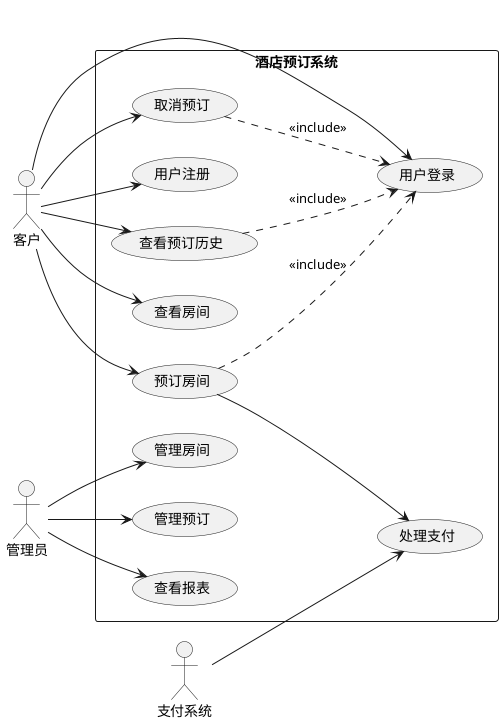

### 4.3 主要用例描述

#### UC2: 预订房间
**主要流程:**
1. 客户选择入住和退房日期
2. 系统显示可用房间
3. 客户选择房间类型
4. 客户填写预订信息
5. 系统处理支付
6. 系统确认预订

---

## 5. 逻辑视图

### 5.1 核心领域模型

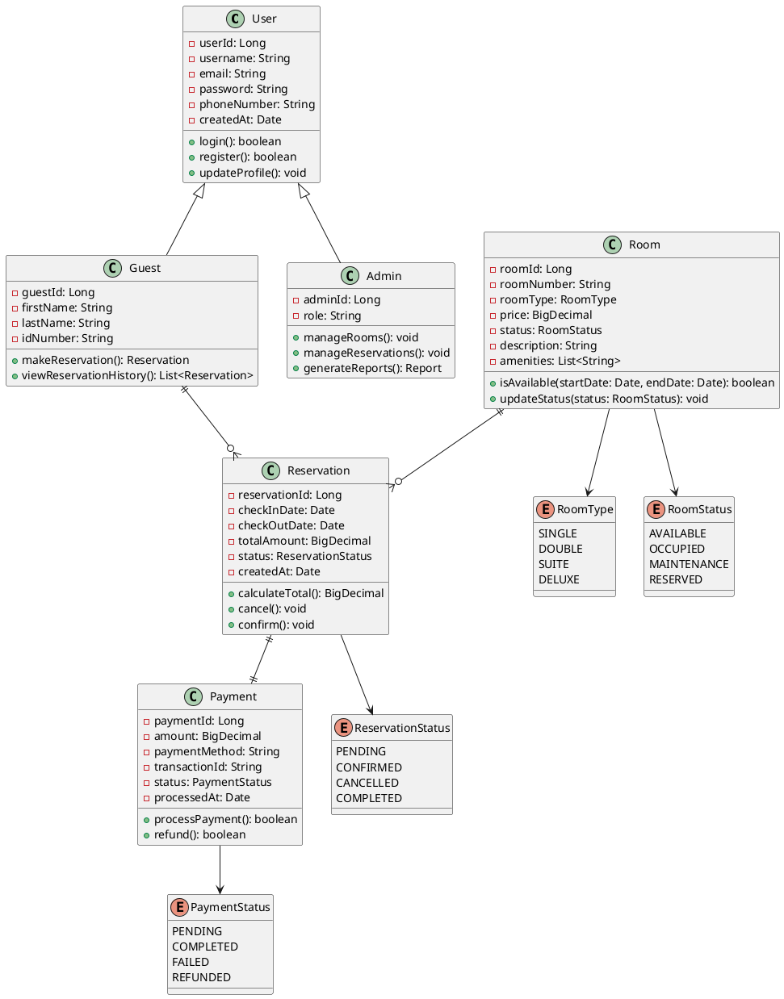

### 5.2 系统分层架构

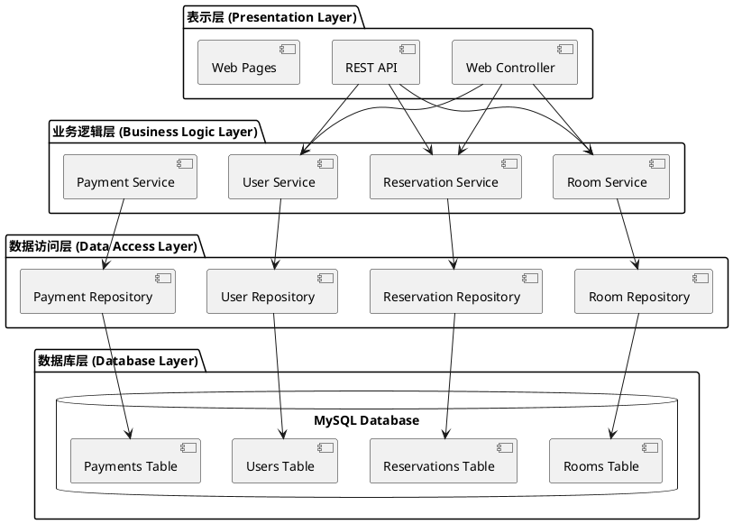

---

## 6. 进程视图

### 6.1 预订房间序列图

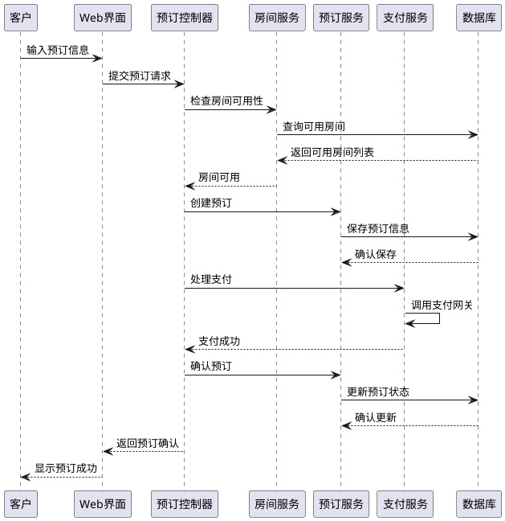

### 6.2 系统状态图

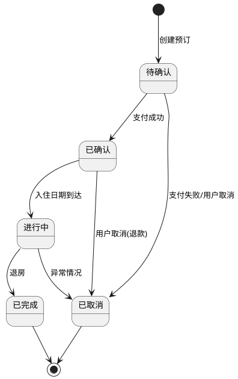

---

## 7. 实施视图

### 7.1 组件图

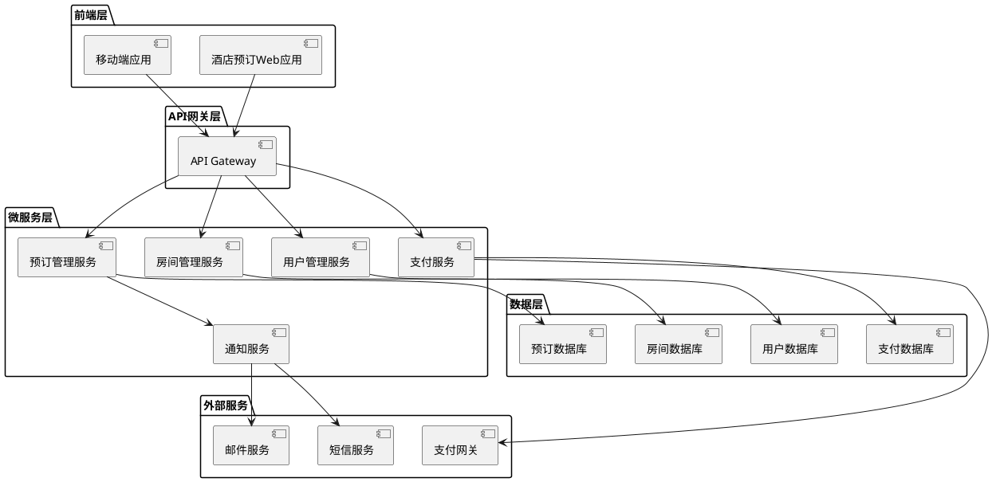

### 7.2 包图

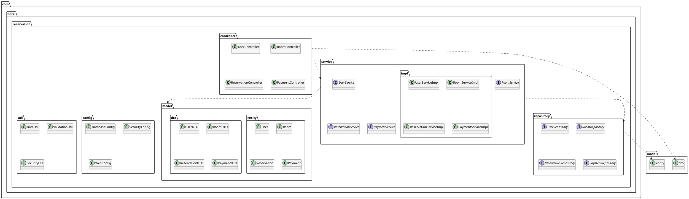

---

## 8. 部署视图

### 8.1 部署架构图

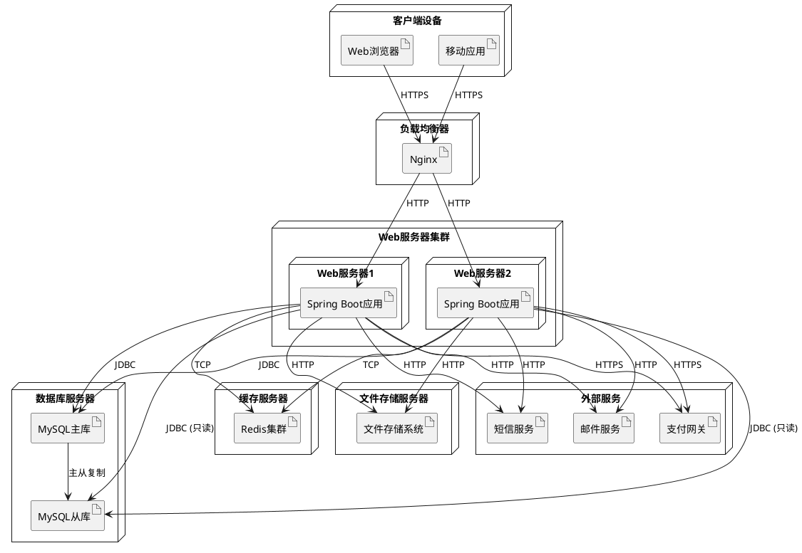

### 8.2 网络架构

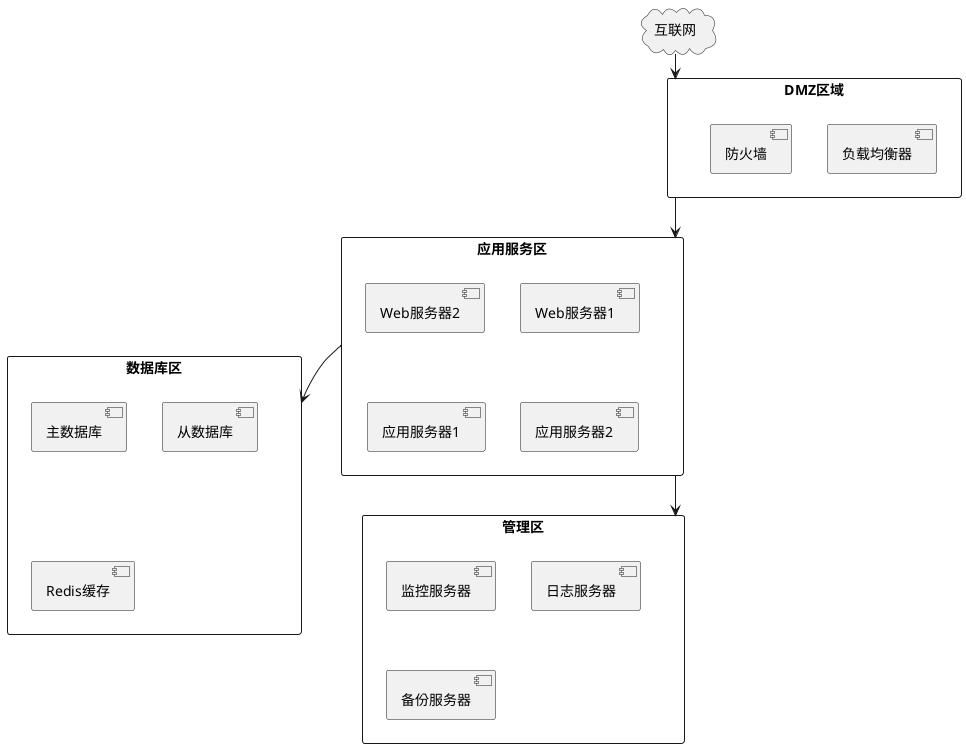

---

## 9. 架构质量

### 9.1 性能要求
- 页面响应时间 < 3秒
- 系统支持并发用户数 > 1000
- 数据库查询响应时间 < 1秒
- 系统可用性 99.9%

### 9.2 安全要求
- HTTPS加密传输
- SQL注入防护
- XSS攻击防护
- 用户身份认证和授权
- 支付数据加密存储

### 9.3 可扩展性
- 水平扩展支持
- 微服务架构
- 数据库分片支持
- CDN内容分发

### 9.4 可维护性
- 代码规范和注释
- 单元测试覆盖率 > 80%
- API文档完整
- 日志记录完善

---

## 10. 附录

### 10.1 设计模式应用

#### 10.1.1 单例模式 (Singleton)
```java
@Component
public class DatabaseConnectionManager {
    private static DatabaseConnectionManager instance;
    
    private DatabaseConnectionManager() {}
    
    public static synchronized DatabaseConnectionManager getInstance() {
        if (instance == null) {
            instance = new DatabaseConnectionManager();
        }
        return instance;
    }
}
```

#### 10.1.2 工厂模式 (Factory)
```java
public class PaymentProcessorFactory {
    public static PaymentProcessor createProcessor(PaymentMethod method) {
        switch (method) {
            case CREDIT_CARD:
                return new CreditCardProcessor();
            case PAYPAL:
                return new PayPalProcessor();
            case WECHAT_PAY:
                return new WeChatPayProcessor();
            default:
                throw new IllegalArgumentException("不支持的支付方式");
        }
    }
}
```

#### 10.1.3 观察者模式 (Observer)
```java
@Component
public class ReservationEventPublisher {
    private List<ReservationObserver> observers = new ArrayList<>();
    
    public void addObserver(ReservationObserver observer) {
        observers.add(observer);
    }
    
    public void notifyReservationCreated(Reservation reservation) {
        for (ReservationObserver observer : observers) {
            observer.onReservationCreated(reservation);
        }
    }
}
```

### 10.2 技术栈说明

#### 10.2.1 后端技术
- **Spring Boot 2.7+**: 主要框架
- **Spring Security**: 安全认证
- **Spring Data JPA**: 数据访问
- **MySQL 8.0**: 关系数据库
- **Redis**: 缓存系统
- **Maven**: 构建工具

#### 10.2.2 前端技术
- **Vue.js 3**: 前端框架
- **Element Plus**: UI组件库
- **Axios**: HTTP客户端
- **Vue Router**: 路由管理
- **Vuex**: 状态管理

#### 10.2.3 部署技术
- **Docker**: 容器化
- **Kubernetes**: 容器编排
- **Nginx**: 反向代理
- **Jenkins**: CI/CD
- **AWS/Azure**: 云平台

### 10.3 数据库设计

```sql
-- 用户表
CREATE TABLE users (
    user_id BIGINT PRIMARY KEY AUTO_INCREMENT,
    username VARCHAR(50) UNIQUE NOT NULL,
    email VARCHAR(100) UNIQUE NOT NULL,
    password_hash VARCHAR(255) NOT NULL,
    phone_number VARCHAR(20),
    user_type ENUM('GUEST', 'ADMIN') DEFAULT 'GUEST',
    created_at TIMESTAMP DEFAULT CURRENT_TIMESTAMP,
    updated_at TIMESTAMP DEFAULT CURRENT_TIMESTAMP ON UPDATE CURRENT_TIMESTAMP
);

-- 房间表
CREATE TABLE rooms (
    room_id BIGINT PRIMARY KEY AUTO_INCREMENT,
    room_number VARCHAR(10) UNIQUE NOT NULL,
    room_type ENUM('SINGLE', 'DOUBLE', 'SUITE', 'DELUXE') NOT NULL,
    price DECIMAL(10,2) NOT NULL,
    status ENUM('AVAILABLE', 'OCCUPIED', 'MAINTENANCE', 'RESERVED') DEFAULT 'AVAILABLE',
    description TEXT,
    amenities JSON,
    created_at TIMESTAMP DEFAULT CURRENT_TIMESTAMP,
    updated_at TIMESTAMP DEFAULT CURRENT_TIMESTAMP ON UPDATE CURRENT_TIMESTAMP
);

-- 预订表
CREATE TABLE reservations (
    reservation_id BIGINT PRIMARY KEY AUTO_INCREMENT,
    user_id BIGINT NOT NULL,
    room_id BIGINT NOT NULL,
    check_in_date DATE NOT NULL,
    check_out_date DATE NOT NULL,
    total_amount DECIMAL(10,2) NOT NULL,
    status ENUM('PENDING', 'CONFIRMED', 'CANCELLED', 'COMPLETED') DEFAULT 'PENDING',
    created_at TIMESTAMP DEFAULT CURRENT_TIMESTAMP,
    updated_at TIMESTAMP DEFAULT CURRENT_TIMESTAMP ON UPDATE CURRENT_TIMESTAMP,
    FOREIGN KEY (user_id) REFERENCES users(user_id),
    FOREIGN KEY (room_id) REFERENCES rooms(room_id)
);

-- 支付表
CREATE TABLE payments (
    payment_id BIGINT PRIMARY KEY AUTO_INCREMENT,
    reservation_id BIGINT NOT NULL,
    amount DECIMAL(10,2) NOT NULL,
    payment_method VARCHAR(50) NOT NULL,
    transaction_id VARCHAR(100) UNIQUE,
    status ENUM('PENDING', 'COMPLETED', 'FAILED', 'REFUNDED') DEFAULT 'PENDING',
    processed_at TIMESTAMP,
    created_at TIMESTAMP DEFAULT CURRENT_TIMESTAMP,
    FOREIGN KEY (reservation_id) REFERENCES reservations(reservation_id)
);
```

---

**文档版本历史:**
- v1.0 (2025-07-16): 初始版本创建

**批准:**
- 架构师: [签名]
- 项目经理: [签名]
- 技术负责人: [签名]

---

## 11. 核心用例详细分析：预订房间

### 11.1 用例概述

**用例名称**: 预订房间  
**用例ID**: UC_RESERVATION_001  
**主要参与者**: 客户 (Guest)  
**次要参与者**: 支付系统, 通知系统  
**前置条件**: 客户已注册并登录系统  
**后置条件**: 预订记录已创建，支付已处理，确认通知已发送  

### 11.2 静态结构分析

#### 11.2.1 核心类图详细设计

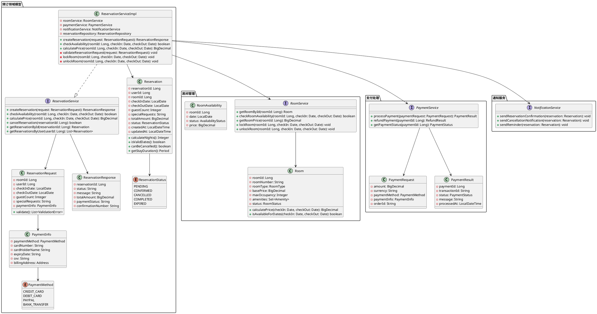

#### 11.2.2 数据访问层设计

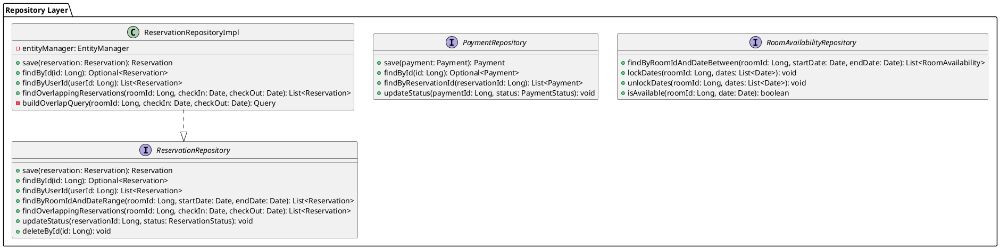

### 11.3 动态结构分析

#### 11.3.1 详细序列图：预订房间完整流程

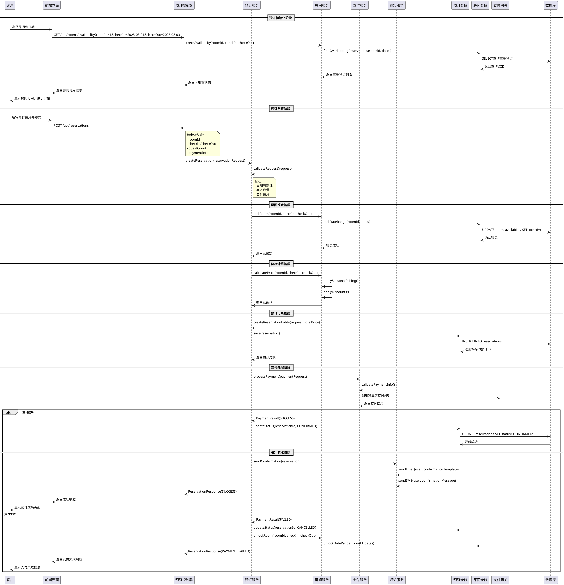

#### 11.3.2 活动图：预订业务流程

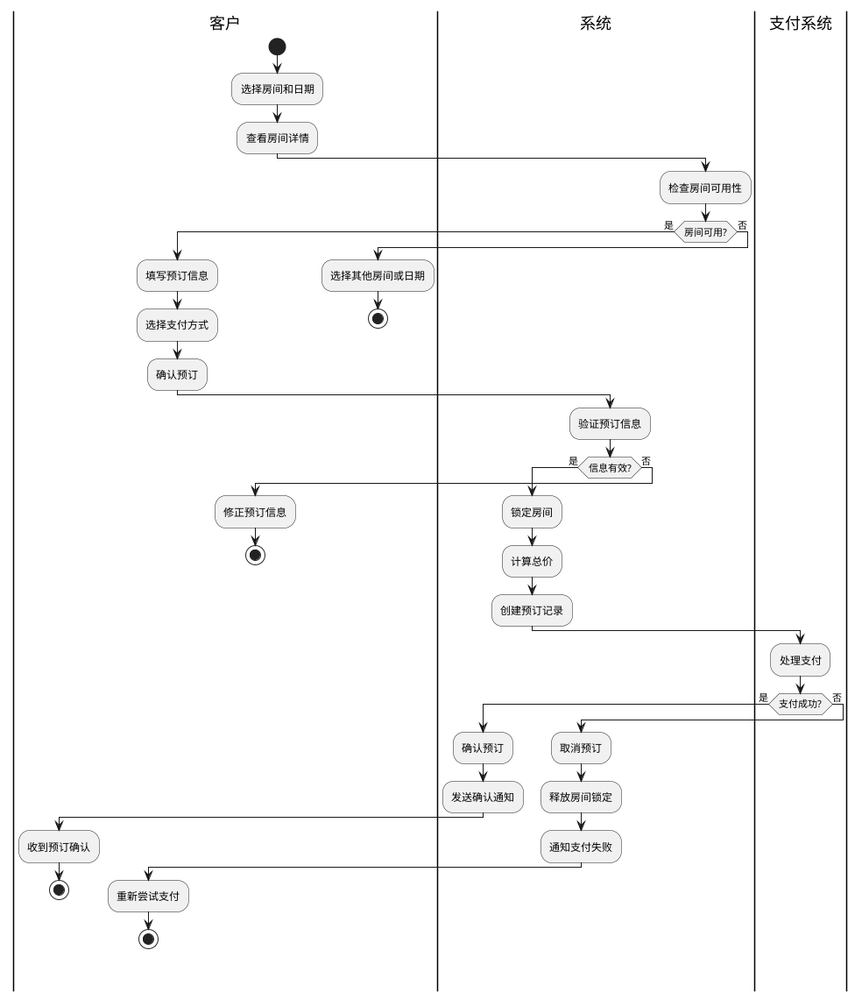

#### 11.3.3 状态图：预订状态转换

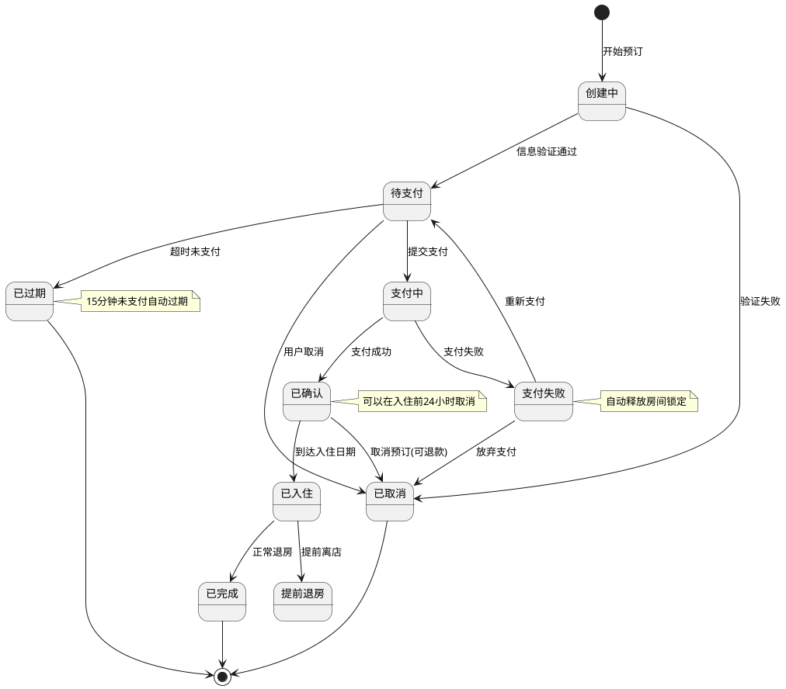

### 11.4 RESTful API接口文档

#### 11.4.1 预订管理API

##### 创建预订
```http
POST /api/v1/reservations
Content-Type: application/json
Authorization: Bearer {jwt_token}

{
    "roomId": 1,
    "checkInDate": "2025-08-01",
    "checkOutDate": "2025-08-03",
    "guestCount": 2,
    "specialRequests": "高层房间，远离电梯",
    "paymentInfo": {
        "paymentMethod": "CREDIT_CARD",
        "cardNumber": "4532************1234",
        "cardHolderName": "张三",
        "expiryDate": "12/27",
        "cvv": "123",
        "billingAddress": {
            "street": "北京市朝阳区xxx街道",
            "city": "北京",
            "state": "北京",
            "zipCode": "100000",
            "country": "中国"
        }
    }
}
```

**响应示例:**
```json
{
    "code": 200,
    "message": "预订创建成功",
    "data": {
        "reservationId": 12345,
        "confirmationNumber": "HTL20250716001",
        "status": "CONFIRMED",
        "totalAmount": 800.00,
        "currency": "CNY",
        "paymentStatus": "COMPLETED",
        "checkInDate": "2025-08-01",
        "checkOutDate": "2025-08-03",
        "room": {
            "roomId": 1,
            "roomNumber": "2001",
            "roomType": "DELUXE",
            "amenities": ["WiFi", "空调", "迷你吧", "保险箱"]
        },
        "createdAt": "2025-07-16T10:30:00Z"
    }
}
```

##### 查询预订
```http
GET /api/v1/reservations/{reservationId}
Authorization: Bearer {jwt_token}
```

**响应示例:**
```json
{
    "code": 200,
    "message": "查询成功",
    "data": {
        "reservationId": 12345,
        "confirmationNumber": "HTL20250716001",
        "status": "CONFIRMED",
        "userId": 1001,
        "roomId": 1,
        "checkInDate": "2025-08-01",
        "checkOutDate": "2025-08-03",
        "guestCount": 2,
        "specialRequests": "高层房间，远离电梯",
        "totalAmount": 800.00,
        "currency": "CNY",
        "createdAt": "2025-07-16T10:30:00Z",
        "updatedAt": "2025-07-16T10:30:00Z",
        "room": {
            "roomNumber": "2001",
            "roomType": "DELUXE",
            "floor": 20
        },
        "payments": [
            {
                "paymentId": 5001,
                "amount": 800.00,
                "paymentMethod": "CREDIT_CARD",
                "status": "COMPLETED",
                "transactionId": "TXN_20250716_001",
                "processedAt": "2025-07-16T10:30:15Z"
            }
        ]
    }
}
```

##### 取消预订
```http
DELETE /api/v1/reservations/{reservationId}
Authorization: Bearer {jwt_token}
Content-Type: application/json

{
    "reason": "行程变更",
    "requestRefund": true
}
```

**响应示例:**
```json
{
    "code": 200,
    "message": "预订取消成功",
    "data": {
        "reservationId": 12345,
        "status": "CANCELLED",
        "refundAmount": 720.00,
        "refundStatus": "PROCESSING",
        "cancellationFee": 80.00,
        "cancelledAt": "2025-07-16T14:30:00Z"
    }
}
```

#### 11.4.2 房间可用性查询API

##### 检查房间可用性
```http
GET /api/v1/rooms/availability
Query Parameters:
- checkInDate: 2025-08-01 (required)
- checkOutDate: 2025-08-03 (required)
- guestCount: 2 (optional, default: 1)
- roomType: DELUXE (optional)
```

**响应示例:**
```json
{
    "code": 200,
    "message": "查询成功",
    "data": {
        "availableRooms": [
            {
                "roomId": 1,
                "roomNumber": "2001",
                "roomType": "DELUXE",
                "basePrice": 400.00,
                "totalPrice": 800.00,
                "maxOccupancy": 3,
                "amenities": ["WiFi", "空调", "迷你吧", "保险箱"],
                "images": [
                    "https://example.com/room1_1.jpg",
                    "https://example.com/room1_2.jpg"
                ],
                "description": "豪华双人房，配备城市景观",
                "availability": {
                    "2025-08-01": {
                        "available": true,
                        "price": 400.00
                    },
                    "2025-08-02": {
                        "available": true,
                        "price": 400.00
                    }
                }
            }
        ],
        "searchCriteria": {
            "checkInDate": "2025-08-01",
            "checkOutDate": "2025-08-03",
            "nights": 2,
            "guestCount": 2
        }
    }
}
```

#### 11.4.3 价格计算API

##### 计算预订价格
```http
POST /api/v1/reservations/calculate-price
Content-Type: application/json

{
    "roomId": 1,
    "checkInDate": "2025-08-01",
    "checkOutDate": "2025-08-03",
    "guestCount": 2,
    "discountCode": "SUMMER2025"
}
```

**响应示例:**
```json
{
    "code": 200,
    "message": "价格计算成功",
    "data": {
        "breakdown": {
            "basePrice": 400.00,
            "nights": 2,
            "subtotal": 800.00,
            "taxes": [
                {
                    "name": "城市税",
                    "rate": 0.06,
                    "amount": 48.00
                }
            ],
            "fees": [
                {
                    "name": "服务费",
                    "amount": 20.00
                }
            ],
            "discounts": [
                {
                    "name": "夏季优惠",
                    "code": "SUMMER2025",
                    "amount": -80.00
                }
            ]
        },
        "total": 788.00,
        "currency": "CNY",
        "validUntil": "2025-07-16T15:30:00Z"
    }
}
```

### 11.5 异常处理设计

#### 11.5.1 业务异常类层次结构

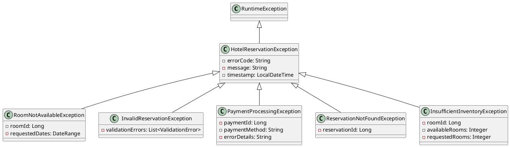

#### 11.5.2 错误响应格式

```json
{
    "code": 400,
    "error": "ROOM_NOT_AVAILABLE",
    "message": "所选房间在指定日期不可用",
    "details": {
        "roomId": 1,
        "requestedCheckIn": "2025-08-01",
        "requestedCheckOut": "2025-08-03",
        "conflictingReservations": [
            {
                "reservationId": 9999,
                "checkIn": "2025-07-31",
                "checkOut": "2025-08-02"
            }
        ],
        "suggestedAlternatives": [
            {
                "roomId": 2,
                "roomNumber": "2002",
                "roomType": "DELUXE",
                "totalPrice": 820.00
            }
        ]
    },
    "timestamp": "2025-07-16T10:30:00Z",
    "path": "/api/v1/reservations"
}
```

### 11.6 性能优化策略

#### 11.6.1 缓存策略

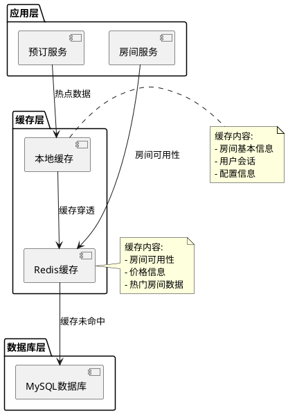

#### 11.6.2 数据库查询优化

```sql
-- 房间可用性查询优化
CREATE INDEX idx_reservations_room_dates 
ON reservations (room_id, check_in_date, check_out_date, status);

-- 用户预订历史查询优化
CREATE INDEX idx_reservations_user_created 
ON reservations (user_id, created_at DESC, status);

-- 房间搜索优化
CREATE INDEX idx_rooms_type_price 
ON rooms (room_type, price, status);

-- 预订状态查询优化
CREATE INDEX idx_reservations_status_dates 
ON reservations (status, check_in_date, check_out_date);
```

### 11.7 监控和日志

#### 11.7.1 关键业务指标监控

```java
@Component
public class ReservationMetrics {
    
    private final MeterRegistry meterRegistry;
    
    // 预订成功率
    private final Counter reservationSuccessCounter;
    private final Counter reservationFailureCounter;
    
    // 预订处理时间
    private final Timer reservationProcessingTimer;
    
    // 支付成功率
    private final Counter paymentSuccessCounter;
    private final Counter paymentFailureCounter;
    
    public void recordReservationSuccess() {
        reservationSuccessCounter.increment();
    }
    
    public void recordReservationFailure(String reason) {
        reservationFailureCounter.increment(
            Tags.of("reason", reason)
        );
    }
    
    public Timer.Sample startReservationTimer() {
        return Timer.start(meterRegistry);
    }
}
```

#### 11.7.2 审计日志设计

```java
@Entity
@Table(name = "reservation_audit_log")
public class ReservationAuditLog {
    
    @Id
    @GeneratedValue(strategy = GenerationType.IDENTITY)
    private Long id;
    
    private Long reservationId;
    private Long userId;
    private String action; // CREATE, UPDATE, CANCEL, CONFIRM
    private String oldStatus;
    private String newStatus;
    private String reason;
    private String userAgent;
    private String ipAddress;
    private LocalDateTime timestamp;
    private String details; // JSON格式的详细信息
    
    // getters and setters
}
```
